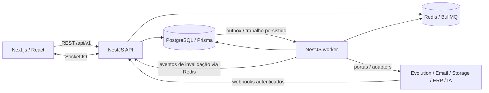
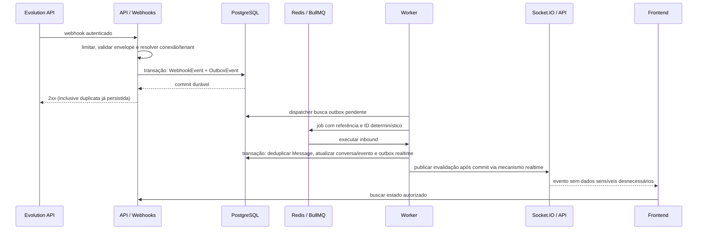

# Arquitetura do CRM comercial

## 1. Escopo, estado e princípios

Decisão inicial: **monólito modular**, organizado em um monorepo pnpm/Turborepo. O produto terá uma aplicação web, uma API e um worker. API e worker são processos do mesmo backend: usam módulos, banco, contratos e releases compatíveis; não constituem microserviços. A fase 0 definiu o desenho. A fase 1 implementa somente a fundação descrita no README: web técnica, API/worker, configuração/logs, health/Swagger e PostgreSQL/Redis/BullMQ. A fase 2 implementa somente a estrutura de organizações, filiais e identidade global com memberships. A fase 3 implementa Auth/AccessControl e protege a estrutura organizacional. A fase 4 implementa layout/design system e sessão web; a fase 5 implementa Contacts, Companies e Tags. As fases 6 e 7 implementam vendas/pipeline e tarefas/timeline/lembretes; a fase 9 implementa catálogo e preços. A fase 8 teve somente ambiente local preparado, com integração CRM adiada para a futura Evolution na VPS. A fase 10 implementa orçamentos; não há integrações externas. ADR-010 registra a fundação; ADR-011 é histórico e ADR-012 encerra a exceção local sem auth.

O objetivo é atender múltiplas organizações, lojas, equipes e vendedores com isolamento forte. Simplicidade, legibilidade, type safety, segurança, testabilidade, baixo acoplamento e evolução incremental orientam escolhas. Não usar Kubernetes, event sourcing, GraphQL ou CQRS completo. Não criar engine genérica, abstrações sem consumidor ou filas para operações síncronas simples.

Arquitetura operacional futura:



PostgreSQL é a fonte de verdade. Redis serve filas, rate limiting/cache e comunicação transitória; a perda de Redis não deve apagar eventos comerciais ou mensagens aceitas. Socket.IO atualiza a interface; não é fonte de verdade nem transporte garantido de eventos comerciais.

## 2. Monorepo e dependências de pacotes

```text
crm_projeto_novo/
├── AGENTS.md
├── ARCHITECTURE.md
├── DATABASE.md
├── ROADMAP.md
├── docs/adr/
├── apps/                         # implementado
│   ├── web/
│   │   └── src/{app,features,components,hooks,lib}
│   ├── api/
│   │   └── src/{bootstrap,modules,common}
│   └── worker/
│       └── src/{bootstrap,jobs}
└── packages/                     # implementado
    ├── database/
    │   └── {prisma,migrations,src}
    ├── contracts/
    ├── ui/
    ├── config/
    ├── eslint-config/
    └── typescript-config/
```

A localização exata de migrations/configuração Prisma será fixada conforme a versão na fundação. A árvore expressa responsabilidades, não ordem para gerar arquivos vazios.

| Pacote/aplicação                     | Responsabilidade e limite                                                                                                   |
| ------------------------------------ | --------------------------------------------------------------------------------------------------------------------------- |
| `web`                                | composição Next.js e features; não acessa banco ou secrets de integração                                                    |
| `api`                                | módulos de negócio, adapters e bootstrap HTTP/Socket.IO                                                                     |
| `worker`                             | bootstrap Nest standalone e handlers de jobs; reutiliza exports públicos backend, sem importar controllers/bootstrap da API |
| `database`                           | schema, migrations, Prisma Client e helpers técnicos de transação; sem serviços de domínio universais                       |
| `contracts`                          | contratos de transporte, schemas Zod públicos e tipos serializáveis; não exporta entidades Prisma nem dependências NestJS   |
| `ui`                                 | componentes shadcn/ui/Tailwind acessíveis, tokens visuais; sem conceitos de CRM                                             |
| `config`                             | schemas de configuração técnica compartilhada; entrada separada por runtime e sem exportar secrets ao navegador             |
| `eslint-config`, `typescript-config` | regras de imports e ferramentas; nenhuma regra comercial                                                                    |

`worker → exports públicos de api/modules` é o único import de aplicação para aplicação inicialmente permitido; deve ser declarado no workspace e no grafo Turborepo, com entrypoint próprio para build. O pacote da API não inicia servidor por efeito colateral ao ser importado. `api` não importa `worker`; `web` nunca importa aplicações backend. Se módulos compartilhados crescerem, avaliar pacote backend interno em ADR, sem convertê-los em serviços remotos.

Turborepo ordena geração/build por dependências; outputs e inputs de cache são explícitos. Não cachear migrations, seed mutável, testes que dependem de estado externo ou resultados com secrets. CI usa lockfile congelado.

## 3. Organização interna do backend

Um módulo representa uma capacidade do negócio, com dono definido. Estrutura exemplificativa, aplicada proporcionalmente:

```text
modules/opportunities/
  domain/             # estados, invariantes e política de movimentação
  application/        # casos de uso e portas mínimas
  infrastructure/     # repository Prisma e adapters
  presentation/       # controller, DTOs e mapeamento HTTP
  index.ts            # exports públicos explícitos
```

Fluxo: controller valida e normaliza request → application autoriza recurso/escopo e coordena transação → domínio aplica invariantes → repository persiste → mapper produz response. Controllers não contêm regras comerciais. Domain usa TypeScript puro; uma operação CRUD simples pode usar application service sem criar hierarquia de classes artificiais.

### Módulos previstos

| Módulo           | Propriedade e responsabilidade                                                                                                  |
| ---------------- | ------------------------------------------------------------------------------------------------------------------------------- |
| `organizations`  | Organization, Branch, Team, memberships, vínculos a filiais/equipes                                                             |
| `users`          | identidade global, perfil e ciclo de vida do usuário; vendedor é usuário com vínculo/permissões, sem tabela Seller inicialmente |
| `auth`           | credenciais, login, sessões, refresh, recuperação de senha                                                                      |
| `access-control` | Role, Permission, RolePermission, UserRole e avaliação granular de escopos                                                      |
| `contacts`       | clientes/pessoas Contact e relacionamento com Company                                                                           |
| `companies`      | empresas clientes B2B; Company nunca representa o tenant                                                                        |
| `tags`           | catálogo organizacional e classificação de clientes; implementado na fase 5                                                     |
| `leads`          | captação, qualificação e conversão transacional local                                                                           |
| `pipelines`      | Pipeline/Stage, ordenação e regras de configuração                                                                              |
| `opportunities`  | negociação, Kanban, dono, movimentação e histórico                                                                              |
| `tasks`          | tarefas, follow-ups e conclusão; calendário não é requisito inicial                                                             |
| `activities`     | timeline comercial e interações visíveis aos usuários                                                                           |
| `messaging`      | canais, conversas, mensagens, anexos e portas de envio                                                                          |
| `integrations`   | conexões/configuração técnica, adapters Evolution/ERP/email/IA/storage e suas credenciais; sem regras comerciais                |
| `webhooks`       | recepção, autenticação, persistência e deduplicação de eventos externos                                                         |
| `catalog`        | Product, PriceList e PriceListItem; implementado na fase 9                                                                      |
| `quotes`         | Quote/Item, revisão, aprovação e snapshots financeiros                                                                          |
| `automations`    | definição versionada, execução e passos assíncronos limitados                                                                   |
| `goals`          | metas por período, organização, filial, equipe ou vendedor                                                                      |
| `reporting`      | consultas e projeções para dashboards/relatórios, autorizadas e limitadas                                                       |
| `notifications`  | notificações persistidas, preferências e entregas                                                                               |
| `audit`          | trilha de mudanças relevantes e acessos administrativos                                                                         |
| `ai`             | casos de uso de IA, orçamento e controle de dados; apenas fase futura                                                           |

`realtime`, `observability` e `jobs/outbox` são capacidades técnicas transversais, não novos domínios. `common` limita-se a erros técnicos, contexto, transporte e utilitários pequenos; não vira depósito de entidades.

### Política de dependência

- Cada módulo exporta casos de uso/queries/portas explicitamente. Nenhum módulo escreve tabelas de outro por um repository compartilhado.
- Dependência síncrona segue uma direção: cadastro/organização/identidade → catálogo/pipeline/contatos → oportunidade/orçamento/tarefas → automações/relatórios. A seta indica uso por capacidades à direita, não imports reversos.
- Auth usa consulta pública de usuário/membership e política de acesso; users não importa auth. Segurança comum recebe serviços através de injeção/composição, sem ciclos de módulos.
- Opportunities consulta pipelines/contacts; pipelines não consulta opportunities para manter estado. Mudanças destrutivas de pipeline verificam referências por consulta de integridade/constraints, sem importar o serviço de oportunidades.
- Messaging define `MessagingProvider`; composition root de API/worker liga adapter de integrations. O domínio CRM nunca chama Evolution diretamente. O adapter depende do contrato da porta, e messaging não importa a implementação.
- Webhooks recebe um registry técnico de conexões autenticadas e publica trabalho normalizado; o processamento invoca messaging pelo contrato público. Messaging não importa webhooks.
- Eventos de fatos consumados desacoplam efeitos posteriores; não substituir validação síncrona obrigatória por evento eventual. Automações consome eventos e invoca casos de uso; módulos comerciais não importam automations.
- Transação que envolve dois módulos conserva o mesmo Prisma transaction client através de um contexto técnico explícito, usado só pela infraestrutura. Exemplo: converter lead cria Contact/Opportunity por exports autorizados e marca Lead na mesma transação. Não fazer transações aninhadas independentes nem vazar Prisma ao domínio.
- Reporting tem acesso de leitura a projeções/views ou SQL revisado, documentado como exceção controlada; nunca escreve em tabelas alheias, contorna scopes ou expõe consultas arbitrárias.
- Usar lint/grafo de imports em CI para impedir ciclos. Não contornar limites com `forwardRef`, chamadas HTTP internas ou barramento universal de comandos.

## 4. Organizações, filiais, equipes e carteiras

`Organization → Branch → Team` é a hierarquia operacional. `User` é identidade global e pode integrar mais de uma organização, filial e equipe. `OrganizationMembership` é o vínculo tenant; `MembershipBranch` delimita filiais dos escopos OWN/BRANCH/BRANCH_SET; `TeamMember` associa a equipe. Equipes pertencem a uma filial inicialmente. Nenhuma associação a equipe concede permissão implicitamente.

Entidades comerciais têm `organizationId` obrigatório; muitas têm `branchId` e `ownerMembershipId`. Branch nula significa escopo organizacional deliberado, nunca passe livre. Tenant Organization e empresa cliente Company são conceitos distintos. Catálogo pode ser organizacional; carteira, conversa, tarefa e oportunidade têm regras de filial/dono explícitas. Transferência de dono/filial exige permissão e auditoria; não há transferência de tenant por atualização de campo.

Contexto tenant vem da organização ativa selecionada e validada contra membership ativa. Um header/path com ID de organização é apenas seleção, não prova de acesso. `TenantContext` servidor carrega organização, membership, permissões e escopos; queries e jobs exigem contexto, filtros e FKs compostas. Tokens antigos não preservam acesso após revogação da membership.

Sem autoescape para superadmin. Suporte de plataforma fica fora dos papéis tenant, desabilitado por padrão, com concessão temporária explícita, organização-alvo, motivo, auditoria e menor privilégio se futuramente necessário. Listagens, agregações e acesso por ID devem aplicar a mesma política. Responder 404 quando revelar a existência de recurso de outro tenant for indevido.

## 5. Autenticação e sessões

- E-mail normalizado e único para identidade global; senha com Argon2id, salt individual e parâmetros medidos na infraestrutura. Nunca criptografar senha de forma reversível. Verificação de e-mail antes de operações sensíveis.
- Access token curto (meta inicial: 5–15 minutos, ajustável), assinado com algoritmo permitido e validação de `iss`, `aud`, `exp`, `sub`, `sid` e identificador de chave. Claims tenant não substituem membership/grants atuais. Chaves rotacionáveis; não aceitar algoritmo recebido livremente do token.
- Refresh token opaco criptograficamente aleatório, armazenado por hash/HMAC e nunca em texto no banco. Session agrupa família, usuário, validade, revogação e metadados mínimos. RefreshToken registra predecessor, uso, expiração e substituição.
- Rotação atômica: bloquear/atualizar condicionalmente token ainda não usado; emitir sucessor uma vez. Reuso confirmado de token consumido revoga a família. Cliente implementa single-flight de refresh, sem múltiplas rotações concorrentes e sem janela genérica de reutilização. Perda de resposta de refresh pode exigir novo login; política explícita, sem relaxar detecção por conveniência.
- Revogar sessões em logout, troca/recuperação de senha, comprometimento e ação administrativa autorizada. Access token é validado contra sessão ativa; cache curto com invalidação limita latência, e comportamento de falha é fechado para endpoints protegidos. Retirada de grants/membership invalida cache de autorização; jobs revalidam autoridade antes de agir.
- Web inicialmente usa access token apenas em memória e refresh em cookie `HttpOnly`, `Secure` em produção, `SameSite` adequado. Não usar localStorage para tokens. API/web publicados sob mesma origem via proxy (`/api` e socket) para simplificar cookies/CORS; desenvolvimento pode usar origens explicitamente configuradas.
- Endpoints com cookies (refresh/logout) verificam Origin/CSRF; se cookies autenticarem outros endpoints, também proteger esses métodos. SSR só usa sessão através de fluxo servidor seguro; não serializar token em HTML ou logs. RSC não implica acesso direto ao banco.
- Recuperação usa token único com hash, prazo curto, rate limit e resposta genérica anti-enumeração. Envio por `EmailProvider`; consumir uma vez, trocar hash de senha e revogar sessões numa transação. Nunca retornar token de recuperação na API pública.
- Rate limiting para login, recuperação, refresh e conexões. Respostas não revelam se conta existe; IP obtido apenas de proxies confiáveis.

## 6. Autorização e RBAC

`Permission` é catálogo global de códigos estáveis. `Role` pertence à organização. `RolePermission` associa ações; `UserRole` associa role à membership com um escopo: `OWN`, `BRANCH`, `BRANCH_SET` ou `ORGANIZATION`. Grants por filial registram `UserRoleBranch`. Não há `if role === ADMIN` como autorização.

Avaliar **cada grant completo**: possui a permissão pedida? Seu escopo cobre o recurso? Nos escopos limitados a carteira/filiais, a filial está nas filiais autorizadas da membership? Se algum grant completo permitir, conceder. Não unir a permissão de um grant OWN com o escopo ORGANIZATION de outro que não possui aquela ação. Organização ativa e recurso precisam coincidir em todos os casos.

- OWN: proprietário é a membership atual e, quando há filial, ela também está autorizada.
- BRANCH/BRANCH_SET: recurso pertence a uma das filiais concedidas, dentro do conjunto autorizado da membership.
- ORGANIZATION: cobre o tenant inteiro, incluindo filiais atuais/futuras, apenas para as permissões desse grant explícito; não exige enumerar filiais em MembershipBranch e não amplia os outros grants da pessoa. Acesso a recursos organizacionais sem filial exige este escopo ou permissão organizacional definida para o caso de uso.
- Recursos sem owner/branch não recebem OWN/BRANCH por suposição. Políticas de catálogo compartilhado e pipelines organizacionais especificam acesso organizacional e leitura concedida para uso comercial.

Exemplos: `contacts.read/create/update/delete`, `opportunities.read/create/update`, `opportunities.move`, `opportunities.assign`, `quotes.read/create/approve`, `reports.branch`, `reports.global`, `users.manage`, `settings.manage`. Read/delete não implicam aprovação, exportação ou transferência. Relatório global exige `reports.global` com escopo ORGANIZATION; branch exige `reports.branch` e filiais autorizadas. Papel é conjunto de ações, não exceção ao isolamento. Um vendedor pode ter contacts.read com OWN e catalog.read com ORGANIZATION em grants distintos; a leitura compartilhada do catálogo não amplia sua carteira. Remover vínculo de filial não revoga um grant ORGANIZATION: para restringir esse poder, revogar ou substituir o grant explicitamente.

API faz check de capacidade no guard e check do recurso/escopo no caso de uso/repository. Guards sozinhos não asseguram autorização de objeto. Ao vincular recursos, validar também acesso ao objeto associado: estar no mesmo tenant não autoriza usar um contato de outra carteira ou filial. Tasks/Activities e anexos herdam a visibilidade do alvo, sem ampliar acesso por um vínculo secundário; reporting documenta as exceções agregadas autorizadas. Grants de administração não permitem conceder automaticamente poderes superiores aos do concedente; mudanças de roles e escopos são auditadas. Testar listagem, lookup por UUID, joins, busca, exportação, bulk, attachment e socket.

## 7. Frontend e experiência futura

Next.js App Router organiza rotas e layouts. Layout autenticado contém seletor de organização/filial, navegação, notificações e estados de erro/loading; a validação real está na API. Componentes client são usados onde interação exige; server components não acessam Prisma. Evitar dupla gestão do mesmo dado entre fetch servidor e TanStack Query: definir hidratação/cache por página.

Menu previsto: Dashboard, CRM, Clientes, Empresas, Leads, Pipeline, Conversas, Tarefas, Orçamentos, Produtos, Automações, Relatórios, Equipe e Configurações. CRM pode agrupar atalhos para Leads/Pipeline/Tarefas; não duplicar fontes de dados.

```text
src/app/                       # páginas, layouts, boundaries de rota
src/features/contacts/
  components/                  # UI com significado de domínio
  hooks/                       # queries, mutations e interação
  services/                    # chamadas ao cliente REST tipado
  schemas/                     # formulários Zod e adaptações de contrato
src/components/                # composição transversal da aplicação
src/hooks/                     # hooks técnicos reutilizáveis
src/lib/                       # HTTP, query-client, sessão e socket
packages/ui/                   # primitives visuais acessíveis
```

TanStack Query gerencia estado remoto, com query keys contendo organização, escopo/filiais, filtros e entidade. Ao trocar organização, cancelar requests antigas, limpar dados privados e reabrir conexão autorizada. Não persistir cache sensível entre usuários por padrão. React Hook Form/Zod valida experiência de formulário, enquanto backend valida invariantes. UI trata conflito 409 em movimentações Kanban e rollback de optimistic updates. Permissões controlam affordances; nunca autorizam ação por si mesmas. Paginação/virtualização para volumes grandes, acessibilidade de teclado, responsividade e estados vazio/erro fazem parte das entregas de cada feature.

## 8. API REST, contratos e erros

- Prefixo `/api/v1`; recursos plurais em inglês e kebab-case. IDs UUID; ações com semântica explícita, por exemplo `POST /opportunities/{id}/stage-transitions` em vez de update irrestrito.
- Swagger/OpenAPI gerado e validado em CI; DTOs/tipos de `packages/contracts` compatíveis com schemas de runtime. Quando usar Zod no Nest, adaptar validação e documentação numa fonte coerente; não manter três schemas manuais divergentes. Prisma não define o contrato público.
- GET não muda estado; POST cria/comanda, PATCH altera campos permitidos, DELETE tem política de arquivamento/exclusão explícita. 200/201/204 conforme operação; 202 apenas quando trabalho assíncrono foi persistido, com ID de acompanhamento autorizado.
- Listas retornam `{ data, pageInfo }`. Preferir cursor opaco por `(createdAt, id)` ou ordenação indexada equivalente; tamanho padrão 25 e máximo inicial 100. Filtros/ordenações em allowlist; paginação offset somente para coleções pequenas controladas. Agregações caras não são automáticas em toda listagem.
- Tempo ISO 8601 UTC; moeda ISO 4217; valores decimais serializados como string. Nunca expor campos de senha, segredo, IDs internos de credenciais ou modelos do fornecedor.
- Erros usam `application/problem+json` (RFC 9457), com `type`, `title`, `status`, `detail`, `instance`, `code`, `requestId` e erros de campos seguros. 400/422 validação conforme contrato, 401 sem autenticação, 403 acesso negado, 404 ausente/oculto, 409 conflito/idempotência/versão, 429 rate limit, 503 dependência indisponível. Sem stack trace, SQL ou payload privado na resposta.
- Mapper central traduz erros de domínio/infraestrutura; erro desconhecido vira 500 com correlação, sem transformá-lo em sucesso. Não fazer catch silencioso nem retornar 200 para falha.
- `version` e update condicional para operações concorrentes relevantes (stage, owner, quote, automação). Cliente envia expectedVersion/If-Match conforme contrato publicado; zero linhas atualizadas retorna conflito. Locks curtos para invariantes multirow; deadlocks/serialização têm retry limitado da **transação local**, nunca retry cego de efeitos externos.
- `Idempotency-Key` em criação de orçamento, envio outbound, importação e comandos com efeito repetível relevante. Chave escopada por organização, ator e operação; hash do request, estado e resposta sanitizada persistidos. Revalidar autenticação e autorização atual antes de retornar resultado armazenado; uma chave antiga não preserva acesso revogado. Mesma chave/corpo retorna resultado anterior; chave/corpo distinto dá 409. Inserção única e controle transacional impedem execução simultânea. GET e updates naturalmente idempotentes não ganham tabela por hábito.

## 9. Banco e concorrência

PostgreSQL/Prisma em schema compartilhado, `organization_id` e integridade por chaves compostas. `DATABASE.md` define ERD, constraints, índices, dinheiro, retenção e migrations. Repositories tenant-scoped explícitos são obrigatórios; uma extensão Prisma automática sozinha não cobre SQL raw, joins ou escrita aninhada.

RLS é reforço futuro sujeito a ADR/testes de pooling e identidade; não é uma promessa presente nem substitui filtros/FKs/RBAC. Desenvolvimento usa bancos de teste isolados. Produção usa backups, restore testado, limites de conexão e credenciais separadas para aplicação/migration. API e worker compartilham orçamento de conexões, sem pool por request/tenant.

Operações financeiras preservam snapshots; posição Kanban tem ordenação determinística; estágio atual e histórico mudam na mesma transação. Uma oportunidade não pode apontar para estágio de outro pipeline. Desnormalizar só mediante consulta medida e dono claro da projeção.

## 10. Integrações externas e Evolution API

Portas limitadas aos casos reais:

| Porta futura        | Contrato orientado ao CRM                                                                       |
| ------------------- | ----------------------------------------------------------------------------------------------- |
| `MessagingProvider` | enviar mensagem, consultar/reconciliar status quando suportado; resultados e erros normalizados |
| `StorageProvider`   | armazenar/ler arquivo por chave privada, URL temporária e remoção                               |
| `EmailProvider`     | entregar e-mail transacional com chave de correlação                                            |
| `ERPProvider`       | sincronizar entidades comerciais por operações explícitas, sem mapear domínio a tabelas do ERP  |
| `AIProvider`        | inferência com orçamento, política de dados e resultado validado                                |

`EvolutionMessagingProvider` pertence à infraestrutura. Credenciais, URLs, identificação de instâncias e payloads Evolution ficam no adapter. `Channel` é o canal comercial independente do fornecedor; `WhatsAppInstance` contém configuração técnica da conexão atual. `Message`/`Conversation` não dependem da tabela específica Evolution para suas regras. Identificadores externos são mapeados com namespace fornecedor/conexão. Fornecedor alternativo exige adapter e testes de contrato, sem reescrever oportunidade/contato.

Fixar versão da Evolution API antes de implementar. Verificar documentação/capacidades reais para autenticação de webhook, tipo/ID de evento, ack, idempotência de envio, download de mídia, status e reconciliação. Não presumir assinatura HMAC nem exactly-once ou método de consulta existente. Instância é vinculada à organização/filial no servidor. Conexão/QR de WhatsApp é dado sensível; acesso restrito e nenhuma exposição indiscriminada.

Adapters têm timeout, limite de concorrência, backoff com jitter e classificação de erro; circuit breaker só quando evidência justificar. Redação de logs, sandbox/test doubles e testes de contrato. Credenciais em secret manager/configuração segura, banco apenas referência e metadados. URLs externas configuráveis precisam de allowlist e prevenção de SSRF (inclusive redirects/DNS/IP privado); não confiar em URL arbitrária de webhook/anexo. ERP futuro usa external mappings, versão e checkpoints, reconciliação e política de conflito explícita; chamadas ERP não entram na transação de orçamento.

## 11. Webhooks e mensagens inbound

Fluxo durável:



No caminho realtime, a invalidação é despachada pela outbox quando confiabilidade do efeito pós-commit for necessária; emit inline pós-commit sozinho não substitui esse despacho. Eventos de presença/digitação podem ser transitórios.

Request do webhook:

1. Limitar body/taxa e validar HTTPS, autenticação disponível e envelope mínimo. Assinatura exige raw body validado antes de parse, se o fornecedor suportar.
2. Resolver conexão autenticada e organização pela configuração do servidor. ID de organização do payload é ignorado como autorização. Instância textual sozinha não autentica.
3. Quando o fornecedor não assinar, definir credencial por conexão no mecanismo suportado (header ou rota secreta), rotacionável e mascarada nos logs/proxy. Allowlist de IP é apenas defesa adicional. Não expor endpoint confiando em nome de instância.
4. Persistir payload limitado e protegido em WebhookEvent, com tipo, conexão, chave de deduplicação, `receivedAt`, hash e correlação. Na mesma transação criar OutboxEvent de ingestão. **Não fazer dual write banco+Redis dentro da request.**
5. Responder rapidamente após commit. Banco indisponível → não devolver sucesso. Redis indisponível após commit → evento permanece aceito e recuperável. Evento duplicado usa constraint única e devolve 2xx sem novo efeito. Credencial inválida/body inválido recebe erro; evento autenticado desconhecido pode ser registrado como ignorado, conforme contrato e retenção.

Deduplicação usa ID estável do fornecedor com namespace conexão+tipo; mensagem usa ID externo+conexão+direção. Eventos de status para o mesmo ID incluem tipo/status/versão para não apagar atualizações legítimas. Se falta event ID, definir fingerprint canônico de campos estáveis específico do tipo; não confiar no hash bruto do payload nem em timestamp de recepção. Documentar limites de uma origem sem identificador estável e reconciliar.

Worker não confia no tenant informado no job: recupera WebhookEvent/conexão, valida tenant e aplica efeito idempotente. Out-of-order é esperado: criação/status antes da mensagem usam estado pendente e regras monotônicas; status de entrega não regride de lido para enviado. Duplicação após retry/crash não cria mensagem/conversa duas vezes. Payload, formato original e dados normalizados têm retenções distintas.

## 12. Mensagens outbound e efeitos incertos

Caso de uso autorizado grava `Message` como pendente e OutboxEvent na mesma transação; a resposta pode ser 202 com Message ID. Worker envia fora da transação, usando ID local como chave do provedor **se houver suporte comprovado**, e registra ack/ID externo/status. Diferenciar `PENDING`, `SENDING`, `ACCEPTED`, `DELIVERED`, `READ`, `FAILED` e `UNKNOWN`; aceite do provedor não equivale a entrega.

Timeout/crash após envio pode significar que a mensagem foi entregue sem o banco receber resposta. Quando não existe idempotência garantida do provedor, marcar resultado incerto, reconciliar por ID/capacidade existente ou requerer tratamento manual autorizado; **não reenviar cegamente**. Reenvio manual explica risco, registra ator/motivo e referência à tentativa anterior. Um lease de banco evita dois workers iniciando o mesmo envio; lease expirado em SENDING não prova que efeito externo não ocorreu.

Preservar ordem por conversa quando necessário com sequência persistida e uma única mensagem em voo por conversa, sem serializar o tenant inteiro. BullMQ global concurrency não fornece ordenação por conversa; a aplicação verifica predecessor/lease. Eventos inbound independentes podem processar em paralelo; atualizações conflitantes usam locks/versão curtos. Rate limit por conexão/fornecedor. Não manter transação aberta durante rede.

## 13. Filas, jobs e processamento assíncrono

BullMQ/Redis para execução; PostgreSQL para intenção durável e progresso importante. Jobs carregam IDs, organização para correlação, versão do schema e referências; não payloads pessoais ou secrets completos. API/worker validam schemas de jobs; versões de release compatíveis e mudanças aditivas. Workers executam com tenant técnico restrito ao trabalho, e operações em nome de usuário revalidam membership/permissões, sobretudo exportações e envios.

| Fila                         | Uso                                        | Concorrência inicial proposta                 |
| ---------------------------- | ------------------------------------------ | --------------------------------------------- |
| `inbound-message-processing` | normalização e persistência inbound/status | 4 por processo, com proteção de conversa      |
| `outbound-messages`          | enviar/reconciliar mensagens               | 2 por processo + limites por conexão/conversa |
| `automations`                | passos de execuções versionadas            | 2, com orçamento/limite por organização       |
| `notifications`              | preparar notificações/entregar canais      | 4; e-mail conforme quota do provedor          |
| `imports`                    | importações em lotes com checkpoint        | 1 por processo, fair scheduling entre tenants |
| `reports`                    | exportações pesadas e relatórios           | 1 por processo, SQL limitado e timeout        |

Números são ponto de partida, não capacidade medida. Ajustar por CPU, pools, quota e filas observadas. Prefetch/retries e limites entre vários workers devem preservar quotas globais (limiter/coordenação), não multiplicá-las inadvertidamente. Não criar uma fila por organização.

- Transitórios seguros: até 5 tentativas como default, backoff exponencial iniciado em 1 s, teto 60 s e jitter; respeitar Retry-After/quota. Defaults revistos por tipo de job. Erros permanentes (schema inválido, conexão revogada, ação proibida) não fazem loop de retry.
- Resultado externo incerto tem política específica da seção 12, sem cair no retry automático padrão.
- BullMQ failed set retido por janela definida + estado `FAILED` persistido e registro de falha durável equivalem inicialmente à dead letter. Alertar, redigir erro e permitir replay seletivo autorizado com mesma identidade de trabalho. Não criar DLQ extra que reproduza loops sem operador.
- Jobs idempotentes com uniques/versão/checkpoints/receipts transacionais. `jobId` determinístico derivado por hash/UUID sem `:` (restrição BullMQ), não suficiente sozinho: jobs podem ser removidos do Redis.
- At-least-once, stalled jobs e shutdowns são esperados. Workers renovam lease/heartbeat; parar aquisição no SIGTERM, terminar ou devolver trabalho com checkpoint. Liberação de lease usa token de posse; timeout antigo não pode concluir lease novo.
- Trabalho durável aceito (WebhookEvent, Message, AutomationExecution, Notification, ImportJob/ReportJob ou outbox) é reconciliado periodicamente contra progresso. Redis com persistência adequada, memória e `noeviction`; infraestrutura cache/Socket.IO segregada do Redis de filas quando houver competição medida.
- Exibir/alertar lag, attempts, falhas, stalled, tempo de processamento e tamanho; ferramenta administrativa de filas é privada, com autenticação, RBAC e payloads redigidos. Queues e jobs não são acessíveis ao navegador.

## 14. Transactional outbox e idempotência

Usar outbox quando uma alteração local precisa produzir um efeito posterior importante: mudança de estágio que dispara automação/notificação, mensagem pendente de envio, webhook aceito antes de Redis, confirmação de orçamento que integra ERP. Gravar estado comercial + OutboxEvent na **mesma transação PostgreSQL**, sem chamada externa.

Não usar por padrão em GET, simples edição sem efeito posterior, cálculos de apresentação, cache descartável, presença/digitação ou writes que só precisam do próprio commit. Activity e AuditLog obrigatórios podem ser gravados diretamente na mesma transação; não precisam de outbox para fingir desacoplamento.

Dispatcher usa batch curto, `FOR UPDATE SKIP LOCKED`, lease com prazo/token e commits antes de tocar Redis. Ciclo conceitual: PENDING → LEASED → DISPATCHED → COMPLETED, com FAILED/retry quando necessário. Enqueue confirmado marca DISPATCHED, **não COMPLETED**. Crash antes/depois do enqueue gera repetição, absorvida por IDs e deduplicação transacional. Sem lock de banco durante enqueue.

Inicialmente cada outbox representa uma entrega lógica a um handler/destino. Quando uma mudança exige destinos independentes, gravar entregas separadas com dedupe por evento+destino, ou router que cria entregas filhas duráveis transacionalmente. Não usar um único status COMPLETED para fingir confirmação de múltiplos consumidores. Só criar tabela específica de fanout quando esse uso existir.

Consumidor de efeito local registra `EventReceipt` (evento+consumer+tenant) e efeito/COMPLETED na mesma transação. Para efeito externo, o estado do trabalho (por exemplo Message UNKNOWN) controla reconciliação; receipt não prova exactly-once remoto. Eventos realtime podem ser concluídos após publicação transitória, porque refetch corrige perda, e não após ack de todos os browsers.

Reconciliador busca outbox DISPATCHED sem conclusão dentro do SLA, verificando lease/progresso do trabalho antes de recolocar; isto cobre perda/reinício de Redis, jobs removidos e crash. Outbox COMPLETED e receipts só expiram após horizonte de replay/deduplicação e backup definidos. Failed outbox retém referência e erro seguro. Scheduler atrasado e outbox em atraso são condições de alerta. Não prometer exatamente uma entrega ponta a ponta.

## 15. Realtime

Socket.IO reside inicialmente na API. Worker comunica invalidações via Redis (emitter/adapter compatível); API autentica conexões e envia a rooms autorizadas. Uma instância pode operar sem adapter distribuído; múltiplas réplicas precisam de adapter e estratégia de transporte/afinidade para long polling. Redis de filas não deve ser usado como simples pub/sub de dados duráveis.

Servidor atribui rooms por organização, filial, usuário ou recurso autorizado. Cliente não escolhe room arbitrária. Para escopo OWN, nunca fazer broadcast com dados comerciais completos a toda filial/organização: resolver destinatários autorizados ou enviar sinal opaco mínimo que provoca refetch autorizado. Identificadores/títulos também podem ser sensíveis. Revogação de sessão/membership/grants remove rooms/desconecta sockets existentes; expiração do token exige reautenticação. Jobs e background broadcasts também aplicam escopo.

Eventos versionados contêm ID seguro, versão e correlação; ignorar atualização antiga no cliente. Reconexão e troca de organização provocam refetch via REST e sincronização de notificações/mensagens persistidas. Socket não substitui auditoria, banco ou autorização. Não permitir comandos comerciais por socket inicialmente; mutations passam pela REST.

## 16. Auditoria, atividades, logs e observabilidade

Activity é histórico comercial consultável; AuditLog é trilha de segurança/integridade. Activity não prova auditoria. Auditar login relevante, acesso administrativo, grants, transferências, mudanças de stage, aprovação/revisão de quote, configuração de integrações e ações sensíveis. AuditLog inclui tenant quando aplicável, ator/membership ou sistema, ação, entidade/ID, campos alterados seguros, hora e request/job/correlation IDs. Evento de autenticação global pode ter organizationId nulo, com consulta restrita à segurança da plataforma.

Auditoria obrigatória de mutações de banco entra na mesma transação; um write que exige auditoria falha se não puder registrá-la. Logs operacionais não são substitutos. Política append-only, acesso restrito e retenção; separar conta de escrita da exclusão e futura exportação protegida quando exigida. Não prometer imutabilidade absoluta frente a administrador do banco.

Logging estruturado JSON para API, worker e adapters, com nível, serviço/release, `requestId`, `correlationId`, `jobId`, `eventId`, tenant e identificadores seguros. RequestId é gerado a cada request; correlationId acompanha o fluxo REST → outbox → job → provedor/webhook → realtime. IDs fornecidos externamente são validados/limitados; não confiar em headers que falsifiquem logs. Persistir associação Message ↔ provider message ID ↔ WebhookEvent para rastreamento sem registrar conteúdo.

Nunca logar Authorization/cookies, tokens, passwords, API keys, rotas secretas, QR, mídia ou payloads pessoais completos. Error stack interno redigido. Separar logs de integração e jobs por campos, sem arquivos por tenant. Retenção e acesso consideram LGPD.

Métricas: latência/erro por endpoint, pool/queries lentas, fila/lag/failed/stalled, outbox aging, tempo webhook→persistência, dedupe, mensagem UNKNOWN/falha, quotas externas e uso de storage. Não colocar IDs de mensagem/usuário/tenant como labels de alta cardinalidade; correlacionar por logs/traces. Planejar OpenTelemetry com sampling quando a fundação de observabilidade for entregue; propagação de contexto não exige tracing distribuído complexo para cada CRUD.

Endpoints futuros:

- `GET /health`: resumo técnico mínimo; detalhes operacionais somente em acesso restrito.
- `GET /health/live`: processo vivo, sem dependências remotas.
- `GET /health/ready`: dependências obrigatórias do papel do processo (DB e, para API que recebe comandos de fila/socket, Redis); retorna 503 quando inapto. Outbox permite aceitar webhook com Redis temporariamente indisponível, mas não implica que todas as capacidades da API estejam prontas. Expor estado degradado no resumo/monitoramento e usar política de roteamento explícita.

Worker tem probe próprio equivalente (porta interna ou verificação de processo/heartbeat) e heartbeat dos loops de outbox/reconciliação. Não chamar Evolution/ERP a cada probe nem revelar versões/secrets publicamente. Timeouts curtos, alerta de degradação e runbooks. Readiness não comprova correção de negócio.

## 17. Segurança e LGPD

- Configuração validada no bootstrap; falhar com mensagem segura se requisito obrigatório faltar. Secrets por ambiente, menor privilégio, rotação e referência; nunca valores em contratos ou `NEXT_PUBLIC_*`.
- TLS em trânsito, criptografia de storage/backups e proteção de payloads sensíveis. CORS allowlist por ambiente, sem `*` com credenciais; confiança de proxy explícita. CSP e mitigação XSS, sanitização de conteúdo renderizado, dependências auditadas.
- Rate limit por IP e identidade/tenant conforme endpoint; limite de body, duração, paginação, exportação e quotas de IA. Validação por schema; SQL parametrizado e ordenação allowlist. Não converter SQL raw em interface pública.
- Uploads privados: limite de tamanho/tipo, detecção real de MIME, nome/key gerados, quarentena/antimalware quando habilitados, download autenticado ou URL curta assinada após autorização. URLs externas bloqueiam SSRF; não servir HTML/SVG ativo inline sem política segura. Anexo pertence à organização/mensagem autorizada; jobs não aceitam storage keys arbitrárias.
- Mass assignment impedido por DTO allowlist e mapeamento; campos como tenant, status financeiro, dono, role e audit actor só mudam por casos de uso próprios. Bindings de tenant em caches/chaves/joins protegem acesso transversal.
- LGPD: inventário de dados/finalidades e bases legais com responsável pelo tratamento; minimização, acesso por necessidade, retenção por categoria e mecanismos de consulta/exportação/retificação/eliminação. Prazos exatos e obrigações fiscais dependem da política aprovada da empresa, não de números inventados aqui.
- Arquivamento não equivale à eliminação LGPD. Exclusão/anonimização deve alcançar mídia, payloads, índices, caches e fornecedores, preservando apenas dados legalmente exigidos. Backup tem expiração e procedimento de reaplicação de exclusões após restore. Auditoria redige PII e preserva trilha mínima conforme finalidade.
- IA só recebe dados aprovados/redigidos; prompt injection de conteúdo de mensagens não ganha acesso a ferramentas, secrets ou outros tenants. Uso humano revisável e sem envio/alteração comercial autônomos inicialmente.

## 18. Testes e critérios de qualidade

Futuras ferramentas de referência: runner TypeScript compatível (Vitest para regras/web; integração Nest com runner escolhido na fundação), Supertest para API e Playwright para browser. Evitar manter runners duplicados por hábito; containers PostgreSQL/Redis via Compose de teste ou Testcontainers, conforme runtime. Na fase 1, Vitest é o runner único, SWC preserva metadata Nest e testes HTTP usam requests reais via fetch; a integração usa Compose isolado e API/worker em processos distintos. Cobertura comercial/Playwright continuam futuras.

| Nível       | Evidência necessária                                                                                                                             |
| ----------- | ------------------------------------------------------------------------------------------------------------------------------------------------ |
| Unitário    | invariantes de domínio, escopos RBAC, dinheiro/arredondamento, estados/ordem de mensagens, retry e classificação de erros com relógio controlado |
| Integração  | PostgreSQL real, uniques/FKs tenant, migrations, concorrência, rollback+audit/outbox, repos autorizados, Redis/BullMQ real e leases              |
| E2E API     | autenticação/sessões, jornadas comerciais, validação, isolamento e jobs até efeito persistido; não só enqueue                                    |
| E2E browser | login, organização/filial, contatos, Kanban com conflito, quote e conversas; acessibilidade e perda/reconexão de socket                          |
| Contrato    | OpenAPI/schemas e adapters Evolution/ERP/email com fixtures sintéticas da versão suportada e sandbox quando disponível                           |

Cobertura obrigatória incremental: login/refresh/reuso/revogação/recuperação; RBAC e isolamento em todas as interfaces; contatos; pipelines; movimentação com histórico e corrida; webhook duplicado/fora de ordem; inbound; outbound com falha/timeout incerto; orçamento/snapshot/aprovação; automação com retry/limite/versão. Testar usuários do mesmo tenant com escopos diferentes e outro tenant com IDs conhecidos. IDs aleatórios não são teste de segurança.

Injetar portas de fornecedores, relógio e gerador de ID onde necessário; sem API externa em unit tests. Integração deve provar crash após enqueue/commit, reconciliação de Redis, claims paralelos e eventos duplicados. CI executa lint/typecheck/build/unit e testes de integração relevantes; E2E de jornadas críticas em merge/release conforme custo. Testes determinísticos com espera por condição e timeout, sem sleeps fixos que escondem corrida. Sem thresholds arbitrários como substituto de cobertura crítica; reportar skipped/failed/unrun separadamente.

## 19. Operação e crescimento

Docker Compose para desenvolvimento: web/API/worker conforme perfil, PostgreSQL, Redis; Evolution opcional apenas na fase de integração, com versão e secrets próprios. Não incluir Evolution obrigatória para desenvolver contatos. Imagens verificáveis/fixadas, healthchecks, volumes nomeados, portas não públicas para banco/Redis e `.env.example` sem secrets na fundação. Execução non-root e resource limits na entrega operacional.

Começar com um banco e um Redis: são pontos únicos de falha conhecidos. Backups PostgreSQL com restore testado; persistência Redis e reconciliadores reduzem perda de trabalho, mas não indisponibilidade. Antes de produção, definir RPO/RTO/SLO com negócio, monitorar, testar recuperação e adotar serviços gerenciados/HA conforme requisitos. Não simular HA apenas aumentando réplicas da API.

Escalar primeiro com índices, paginação, limites/pools, batch jobs, workers separados por workload e API horizontal quando necessário. Adapter Socket.IO, coordenação de rate limits/leases e transações preservam semântica em múltiplas réplicas. Reporting pode usar projeções e réplica de leitura com atraso explícito; aprovação e autorização não usam leitura atrasada. Separação física de tenant ou módulo exige dados de escala/regulação e ADR; não se assume microserviço como evolução inevitável.

Releases compatíveis API/worker/jobs/contracts e migrations expand/contract. Feature flags pequenas e rastreáveis quando necessárias, sem dezenas de flags iniciais. Externos usam porta estável; não adicionar generic ERP ou AI framework antes de caso real. Futuras integrações têm orçamento, versão, idempotência, reconciliação e teste de contrato.

## 20. Revisão crítica consolidada

Esta revisão é documental: não demonstra aplicação rodando. Riscos e correções incorporadas:

| Risco                                                  | Decisão corretiva                                                                | Validação futura / risco residual                                       |
| ------------------------------------------------------ | -------------------------------------------------------------------------------- | ----------------------------------------------------------------------- |
| Ciclos entre auth/users ou worker/API                  | exports públicos, composição de adapters, import unidirecional e lint            | grafo/build da fundação; pacote backend separado apenas se necessário   |
| Tenant filtrado na API mas vazado em joins/jobs/socket | TenantContext, FKs compostas e autorização de objeto em todas as fronteiras      | testes com tenants/filiais distintos, attachments, relatórios e sockets |
| Misturar permissão limitada com escopo amplo           | avaliar grant completo; filiais concedidas limitadas à membership                | testes adversariais de combinações Role/UserRole                        |
| Perder webhook entre commit e enqueue                  | WebhookEvent + outbox atômicos e resposta pós-commit                             | simular Redis fora/crash; retenção deve cobrir replay                   |
| Perder job após dispatcher considerar entregue         | DISPATCHED não é COMPLETED; reconciliação por estado durável                     | Redis reset, stalled e leases expirados                                 |
| Duplicar mensagem outbound em timeout                  | estado UNKNOWN, provider idempotency somente comprovada e reconciliação          | fornecedor pode não permitir resolução automática; intervenção manual   |
| Dois workers e status fora de ordem                    | leases com fencing, uniques, versões e política de estados                       | testes concorrentes; relógio/latência e limites do provedor             |
| Kanban/orçamento inconsistente                         | expectedVersion, transação histórico+estado e snapshots financeiros              | conflitos visíveis e testes de arredondamento/concorrência              |
| Queries lentas / vizinho ruidoso                       | índices tenant-first, keyset, quotas, jobs em lote e métricas                    | revisar EXPLAIN com volume representativo; sem tuning especulativo      |
| WebSocket vazar carteira                               | destinatários autorizados, revogação e refetch                                   | socket é best-effort e não prova recebimento                            |
| Domain preso à Evolution ou ERP                        | contratos CRM, namespace externo e adapter testável                              | capacidades reais do fornecedor ainda precisam ser confirmadas          |
| Abstrações excessivas                                  | portas apenas nas fronteiras; sem event bus universal, CQRS ou DLQ extra inicial | revisar complexidade a cada fase                                        |
| PostgreSQL/Redis únicos                                | backup/restore, reconciliadores, monitoramento e requisitos de HA pré-produção   | indisponibilidade permanece até redundância definida                    |
| Auditoria/logs violarem LGPD                           | redigir dados, separar categorias e definir retenção operacional/legal           | decisões de retenção, bases legais e SLO exigem validação do negócio    |

Documentos correlatos: `DATABASE.md` detalha integridade; `ROADMAP.md` define entregas e gates; ADRs registram tradeoffs. Nenhuma integração, versão de API externa, comando de aplicação ou cenário funcional foi validado apenas por escrever esta arquitetura.

## Implementação estrutural da fase 2 — histórico

Organizations contém policies puras em domain, service de casos de uso em application, repository/mappers Prisma em infrastructure e controller/validação HTTP em presentation. Users contém um gateway público de identidade, sem auth. Dependência unidirecional: infraestrutura de organizations → export público de users. Uma transação Prisma cria User por esse gateway, OrganizationMembership, MembershipBranch e filial principal. Falhas fazem rollback de todos os efeitos; não há outbox sem consumidor. Queries de membros selecionam vínculos do tenant e consultam identidades públicas em lote pelo gateway, sem N+1 ou acesso direto à tabela users pelo módulo organizations. Erros de domínio contêm códigos semânticos; somente o filtro HTTP decide 400/404/409.

A API oferece sete operações mínimas (README), com Zod strict, UUIDs, e-mail/código/documento normalizados, projeções públicas e listas com limite/cursor. Índices compostos tenant-first sustentam filtros e ordenação UUID estável. Sem interface repository genérica, models antecipados, alteração de perfil, autenticação parcial ou eventos sem uso. Filiais/organizações/usuários inativos continuam visíveis na inspeção estrutural, mas não recebem novas associações.

**Limite histórico encerrado na fase 3:** os endpoints de gestão são não autenticados exclusivamente no ambiente local conforme autorização explícita da fase 2. Não existe TenantContext autenticado nesta entrega. O path organizationId é seleção; filtros e FKs evitam mistura de registros, mas não impedem um operador local de consultar outro tenant por ID. API bind 127.0.0.1 deve ser preservado e nenhum proxy/túnel/deploy público deve expor a gestão antes da fase 3. CORS não impede acesso via clientes HTTP. A fase 3 protegerá estes mesmos casos de uso com sessão, grants e contexto servidor; não manter uma segunda implementação de gestão.

Filial principal pertence à membership e depende da existência de MembershipBranch correspondente por FK composta. Membership sem branches não concede ORGANIZATION; RBAC continua planejado. E-mail globalmente único não serve como autorização nem associação automática. Hash de senha e sessões serão adicionados pelo fluxo completo de credenciais (ADR-008), sem campos ou valores fake agora. Team e auditoria não pertencem ao escopo executado desta fase. Ver ADR-011 para atualização explícita do gate original do roadmap.

## Implementação vigente de autenticação/RBAC — fase 3

ADR-012 detalha as decisões e a compatibilidade com ADR-006/008. Auth depende de Users, OrganizationsContext e AccessControl; Organizations HTTP depende de AccessControl; AccessControl depende somente de OrganizationsContext e infraestrutura. Nenhum forwardRef ou dependência circular. Seed da API abre ApplicationContext sem servidor HTTP e sem Redis, reutilizando módulos/gateways dos donos. Worker permanece sem Auth e sem secret JWT.

Login verifica Argon2id fora da transação, depois confirma snapshot da credencial e cria Session+RefreshToken atomicamente. Uma única membership ativa seleciona contexto; duas ou mais exigem POST /auth/context. A seleção verifica pertencimento, atualiza contexto/cv sob lock e emite access novo. Não aceita tenant pela URL/body como autorização. GET /auth/me devolve identidade pública, memberships próprias e contexto sem secrets. Hash nulo identifica usuário ainda não provisionado, incapaz de login; não existe senha fake ou convite parcial.

Access dura até 15 min; sessão absoluta até 30 dias. HS256 com allowlist/issuer/audience/exp/iat/typ e secret de 256 bits sem defaults. Session é consultada em toda request: revokedAt, expiresAt, User.active/securityVersion e contextVersion. Grants/membership/org ativos são relidos para autorizar recursos; suspensão/revogação é imediata. Troca de senha e logout-all incrementam securityVersion e revogam todas as sessões atomicamente. Logout por cookie revoga sua sessão, inclusive access; sessões de outros dispositivos permanecem independentes. Método interno SessionRepository.revokeSession permite revogação por principal validado. Recuperação/EmailProvider continuam futuros.

Refresh opaco só em cookie, persistido por SHA-256. Transação bloqueia Session, relê geração, marca usedAt e cria sucessor; predecessor é único e pertence à mesma família por FK composta. Reuso revoga família e confirma commit antes de responder 401. Duas chamadas concorrentes com a mesma geração resultam em consumo único e revogação por reuso; cliente futuro deve usar single-flight. Perda da resposta pode exigir novo login; não há janela de graça que favoreça token roubado.

Cookies HttpOnly/SameSite=Lax/Path=/, sem Domain; produção exige Secure e nome __Host-crm-refresh. Publicação prevista em mesma origem via proxy TLS; development/test usa crm_refresh local. Login/refresh/logout exigem JSON e Origin exato do allowlist, inclusive chamadas CLI. Não aceitar refresh no body nem access por cookie. CORS credentials com origens explícitas; Cache-Control no-store. Swagger descreve Bearer e refresh cookie; health/docs são técnicos públicos, sem dados administrativos.

Guards globais: Auth verifica identidade/sessão; Access exige policy explícita (identity-only, permission ou public). Ausência de policy nega. Alterar organização/filiais/usuários e gerir grants exige permissão com scope ORGANIZATION. GET organização exige organizations.read/ORGANIZATION. Listas branches/users aplicam escopo no SQL antes de cursor/limit: OWN retorna própria membership e diretório de filiais vinculadas; BRANCH/BRANCH_SET retornam filiais explicitamente autorizadas e memberships nelas; resposta reduz branchIds/principal às filiais visíveis. O avaliador de recursos OWN exige ownerMembershipId correspondente, mais filial ativa autorizada quando existir; sem owner não concede acesso.

Role e UserRole pertencem a tenant; Permission é global e tem domínio ORGANIZATION/PLATFORM. Permission+scope são avaliados por grant completo. Um users.manage/ORGANIZATION não amplia branches.read/BRANCH de outro papel. Delegação requer users.manage/ORGANIZATION e cobertura de cada permissão/escopo do papel pelo concedente; alterações do próprio papel são proibidas. Transações bloqueiam memberships ator/alvo em ordem e relêem grants. Role templates são dados, nunca if ADMIN. Endpoints não editam definições de roles nem concedem plataforma.

POST /organizations exige PlatformGrant temporal de organizations.create/ALL; não autoriza leitura de outros tenants. Na transação cria organização, membership explícita do criador, templates e grant ADMIN/ORGANIZATION. Opt-in local SEED_PLATFORM_PROVISIONING cria concessão de 24h com motivo; padrão false e seed recusa produção. Não existe SUPER_ADMIN global com acesso a todos os dados. Provisionamento de plataforma em produção precisa de operação controlada externa a esta API.

Rate limit usa o cliente Redis central e Lua INCR+PEXPIRE atômicos: login IP 30/min e IP+hash de e-mail 5/5min; refresh IP 60/min, configuráveis e finitos. Sem confiança em X-Forwarded-For enquanto não houver proxy configurado. Retorna 429/Retry-After; Redis indisponível retorna 503 nesses fluxos. Não há bloqueio permanente, fallback em memória ou cache de RBAC. Senha ausente/inativa realiza verificação com hash neutro para reduzir enumeração; resposta genérica 401. Cookies/token não são logados, erros de persistência permanecem seguros e falhas inesperadas não são capturadas como sucesso.

## Frontend implementado — fase 4

ADR-013 registra design system compartilhado em packages/ui, tokens Tailwind/shadcn, fonte Geist local via Next Font, shell responsivo e login real. Layouts/páginas/metadata são Server Components; interação fica em fronteiras Client explícitas. SessionClient concentra credenciais em memória e snapshot backend, com refresh single-flight/Web Locks entre abas e sinalização sem tokens por BroadcastChannel. Requests antigas são abortadas e suas respostas descartadas ao trocar contexto/identidade. Logout depende da revogação real. ApiClient valida respostas usando contracts e não conhece Prisma/Nest.

Auth/context expõe permissões do contexto para UX, sem duplicar escopos no frontend. API continua sendo a única autoridade. Can não substitui autorização de recurso. TanStack Query não foi antecipado para duplicar auth; será usado pelas features interativas sob as regras de cache da seção 7. Nenhum dado privado é renderizado em RSC nesta fase; placeholders possuem somente conteúdo estrutural público. Gate de rotas protege UX e redireciona visitantes, sem criar segunda sessão Next/BFF.

Por solicitação expressa, todas as entradas do menu possuem página-base com composição comum e sem dados comerciais fictícios. docs/DESIGN_SYSTEM.md detalha tokens e componentes. Não existe CRUD comercial, dashboard real, inbox ou Kanban. Playwright valida frontend com API/PG/Redis reais descartáveis; Vitest DOM valida componentes/HTTP/sessão, preservando as suites anteriores.

## Fundação comercial implementada — fase 5

ADR-014 registra Contact/Company com filial e ownerMembership obrigatórios, Tag/ContactTag e histórico mínimo de transferências. A FK tenant+owner+filial aponta a MembershipBranch. Reatribuição deve preservar acesso na origem/destino para update e assign; OWNER global não é uma chave de carteira. Grants comerciais e administrativos continuam independentes.

ContactsModule depende dos exports CompaniesLookupGateway, TagsLookupGateway e CommercialDirectoryGateway. Gateways recebem transação exclusivamente em infrastructure, sem circularidade ou acesso Prisma nos controllers/application. Companies não importa Contacts: a página de empresa usa GET /contacts?companyId=... com autorização de contatos e acesso à empresa revalidados. Projeções de empresas associadas ficam ocultas quando companies.read não alcança o objeto.

Listas aplicam tenant e scopes no SQL antes da keyset existente `{data,pageInfo}`; ordenações permitidas têm id como desempate. APIs CRUD comerciais são bearer; PATCH/DELETE exigem versão esperada. DELETE desativa e preserva relações, não cria exclusão física. Updates condicionais impedem lost updates. Transferências gravam ContactAssignmentHistory/CompanyAssignmentHistory na mesma transação; não antecipam AuditLog completo ou timeline. Não há eventos, outbox ou filas sem consumidor.

A política de telefone foi refinada nesta fase: Contact tem unique por tenant+telefone normalizado; e-mail comercial permanece não único. A normalização não presume DDI ou país. Documentos presentes são identificadores opacos únicos por tenant/tipo de entidade; regras fiscais não fazem parte do núcleo. Tags só classificam contatos; gestão exige tags.manage/ORGANIZATION, leitura exige tags.read válido. Matriz completa e consequências ficam no ADR-014. Seed só amplia templates da demo e templates de organizações novas; nenhum grant de outro tenant é expandido pela migration.

Web usa TanStack Query sobre o ApiClient/SessionClient existente, com queries/mutations em features/commercial. Cache é privado por identidade, organização, membership e cacheScopeKey derivada no servidor dos grants/filiais; quando o contexto atualizado muda, cancela requests e descarta Client anterior. Nunca persistir access, cache privado ou scopes em storage. A chave de cache não autoriza acesso e não substitui revalidação backend. Contratos estritos do contexto exigem release API/web coordenado.

Filtros são estado de URL; busca tem debounce e cancela requests obsoletos. Formulários RHF/Zod preservam valores em erro, usam versão e não apagam associações não alteradas/ocultas. Listagens, cadastros, detalhes, edição e confirmação de desativação são funcionais; demais módulos permanecem páginas-base da fase 4. Loading/empty/error/forbidden/retry e navegação responsiva usam o design system existente.

Logging comercial contém tipos de evento e IDs, com requestId/correlationId propagados pelo contexto assíncrono. Nome, telefone, documento, e-mail e notas não são payloads de log. Listas carregam rótulos em lotes e têm limite 100; índices B-tree para tenant, owner, filial, ordenação e joins. Busca substring pode examinar registros autorizados do tenant; não promete índice de texto antes de medição. Teste PostgreSQL real usa volume representativo e EXPLAIN para conferir o índice de ordenação padrão.

## Implementação incremental — fase 6

A autorização explícita da fase 6 acrescenta LeadsModule, PipelinesModule e OpportunitiesModule, conforme ADR-015. Cada módulo possui controllers finos, services de aplicação, regras de domínio e repository/gateway de infraestrutura. Grafo: Leads → Opportunities → Pipelines; Leads/Opportunities → gateways públicos Contacts/Companies/Organizations/AccessControl. Não há import reverso Opportunities → Leads, repository alheio ou HTTP interno.

Conversão local revalida grants/session e usa uma única transação: cliente/empresa opcionais pelos proprietários, oportunidade+histórico inicial, lead convertido. Row lock, unique tenant+lead e hash da intenção tornam retries seguros. Histórico de movimento e estado corrente usam mesma transação com expectedVersion; perda exige motivo e reabertura limpa fechamento. Catálogo de pipeline tem política explícita para organização/filial; gestão exige grant organizacional específico. Moeda é explícita e valores são strings Decimal.

Frontend possui listas/fichas de leads e oportunidades, conversão, configuração de pipelines/etapas e Kanban com paginação por coluna. SessionClient/TanStack Query e keys por contexto permanecem únicos. Mover por drag abre confirmação equivalente à ação por teclado; mutação otimista guarda snapshots e reverte em conflito/falha, sempre refazendo a leitura autorizada. Não cria serviços, envs, outbox, filas comerciais, sockets ou tarefas. Veja README para endpoints e operação, DATABASE para FKs e ROADMAP para evidência dos gates.

## Implementação incremental — fase 7

ADR-016 acrescenta TasksModule, ActivitiesModule e NotificationsModule. Tasks possui tarefa/follow-up, atribuição, estado, histórico e intenção de lembrete; Activities possui interações manuais; Notifications possui avisos internos privados. TasksCore consulta gateways públicos Contacts/Leads/Opportunities. Activities agrega consultas públicas Tasks/Opportunities, sem copiar eventos de etapas. TaskRemindersModule publica somente a infraestrutura de entrega para o worker standalone. Composição HTTP é separada das interfaces reutilizadas, sem import API → worker ou dependência circular.

Toda tarefa exige filial e responsável membership vinculados. O alvo primário é opcional e explícito: Contact, Lead ou Opportunity. Activity exige exatamente um alvo. As FKs e CHECKs reforçam essa cardinalidade e integridade tenant. OWN/BRANCH/BRANCH_SET/ORGANIZATION continuam por permission+scope do mesmo grant; tarefa vinculada exige também leitura atual do alvo. Timeline e notificações preservam essa interseção antes da paginação. Não há autorização por papel, transferência entre tenants ou vínculo que conceda acesso.

Conclusão/reabertura/arquivamento/PATCH revalidam sessão/grants, fazem lock curto e exigem expectedVersion. TaskHistory é mínimo e transacional, com autoria membership e uma ocorrência por versão; não substitui AuditLog geral. Transferência exige update/assign na origem e destino. Datas ISO exigem offset, persistem UTC e são apresentadas no fuso do navegador. Hoje na web representa o dia local enviado como intervalo UTC; today direto na API representa dia UTC.

Para lembrete concreto, a transação grava TaskReminder junto da mudança. Request nunca depende de Redis. Worker PostgreSQL-aware reconcilia intenções elegíveis a cada 15s, adquire leases SKIP LOCKED e usa BullMQ notifications com concorrência 4, cinco tentativas, backoff limitado/jitter e ID determinístico. Consumidor revalida destinatário ativo, grant/scope, tarefa/alvo e geração; grava Notification + checkpoint na mesma transação. Unicidade no banco impede duplicatas. Cancelamento, falhas duráveis, retry autorizado e métricas de pendência/falha/atraso estão implementados. Reconciliador recupera jobs ausentes/leases vencidos. Sem OutboxEvent genérico, broker novo ou Socket.IO: há apenas um efeito interno identificado.

Worker passa a exigir DATABASE_URL; não exige JWT_SECRET nem abre HTTP. Shutdown para novas aquisições, drena consumidores/filas e só então encerra Prisma em onApplicationShutdown. Web reutiliza SessionClient e cache por contexto; lista/detalhe/formulário de tarefas, follow-up/timeline nas fichas existentes e notificações privadas paginadas. Falhas aparecem com retry; permissões visuais não substituem backend. Nenhum módulo de WhatsApp/Evolution da fase 8 foi implementado.

## Catálogo implementado — fase 9

ADR-017 define Product organizacional, PriceList organizacional/filial e PriceListItem. O usuário adiou a instalação da Evolution para sua VPS e autorizou seguir com catálogo, independente de messaging. A fase 8 permanece com somente ambiente local preparado, sem integração CRM; a fase 10 implementa orçamentos conforme ADR-018.

Leitura de produto é catálogo compartilhado com products.read válido; gestão exige products.manage/ORGANIZATION. price-lists.read permite listas compartilhadas e das filiais autorizadas pelo mesmo grant; OWN usa seus vínculos de filial apenas para leitura. Gestão de lista compartilhada exige ORGANIZATION; gestão de filial exige price-lists.manage que cubra aquela filial. NULL não amplia autoridade. Responses de listas trazem canManage calculado pelo backend; lookup paginado de filiais traz organizationAllowed. São indicações de UX, nunca autorização de uma escrita posterior.

Unidade do produto, moeda e filial da lista são imutáveis pela API. Preço unitário numeric(18,6) passa como string, sem float/câmbio/arredondamento silencioso. Valor total de oportunidade conserva numeric(19,4): são grandezas distintas com schemas em money.ts. Futuro quote terá snapshot e política de arredondamento própria; nenhuma alteração do catálogo deverá recalcular documento emitido.

Repositories concentram Prisma/transações, controllers validam contracts e CatalogService coordena operações/logs. Escritas revalidam sessão/grants sob lock de membership. Produto tem expectedVersion; lista é agregado versionado para nome/arquivamento/itens. Lista é travada antes de mudar preço; produto ativo é conferido sob FOR SHARE, compatível com seu arquivamento sob FOR UPDATE. Unique decide SKU/nome/item concorrente; conflito seguro retorna 409. Item pode ser arquivado e reativado explicitamente pelo PUT. Produto/lista arquivados rejeitam alterações e preservam referências.

Web implementa /products, /products/[id], /products/price-lists e /products/price-lists/[id], reutilizando shell, tokens, RHF/Zod, SessionClient e TanStack por organização/membership/cacheScopeKey. Listas filtram/paginam no SQL, detalhe não carrega itens ilimitados. Catálogo não inclui importação, estoque, ERP ou novos jobs/outbox. Quotes é seu consumidor concreto conforme a seção seguinte, sem gateway especulativo ou dependência externa.

## Orçamentos implementados — fase 10

Quotes → gateways públicos Catalog, Contacts, Companies, Opportunities, Organizations e AccessControl. Não há import reverso ou escrita em tabelas alheias. Controllers validam contracts; QuotesService coordena/loga IDs; QuotesRepository concentra transações; cálculo exato com BigInt vive no domínio. Quotes owns documento, itens, histórico específico e dedupe de comandos. API/worker continuam no mesmo monólito; quotes não exige worker porque não há efeito assíncrono solicitado.

Quote exige tenant/filial/owner membership e um comprador. Criação tem owner=ator; revisão preserva owner. Cada ação e vínculo verifica seu próprio scope, sob revalidação de sessão/grants para escrita. Snapshot do documento possui visibilidade própria quotes.read; não é lookup indiscriminado do cadastro atual. Listas filtram antes da paginação; histórico pagina por versão. Responses explícitos não expõem hash de idempotência/autores internos de aprovação ou campos Prisma.

DRAFT pode mudar itens/quantidade/desconto, validade e notas. APPROVED é imutável no agregado/banco. Uma revisão é outra identidade ligada a root/previous e número de revisão, com original preservado e sem ramificação. Approval exige permissão específica e versão; validade expirada impede aprovação. QuoteHistory append-only é gravado na mesma transação; não substitui audit universal.

Idempotency-Key obrigatório em criação/revisão: chave e intenção hasheadas, única tenant+ator+operação, resposta pública armazenada junto do documento. Retry revalida ação/leitura/scope atual; nenhuma concessão antiga persiste por idempotência. Não há estado intermediário órfão, evento inútil, envio fake ou outbox sem consumidor. Snapshot, cálculo/arredondamento, matriz de templates, locks e consequências estão no ADR-018. Web mantém SessionClient, cache privado por contexto, RHF/Zod e tokens/UI únicos.
