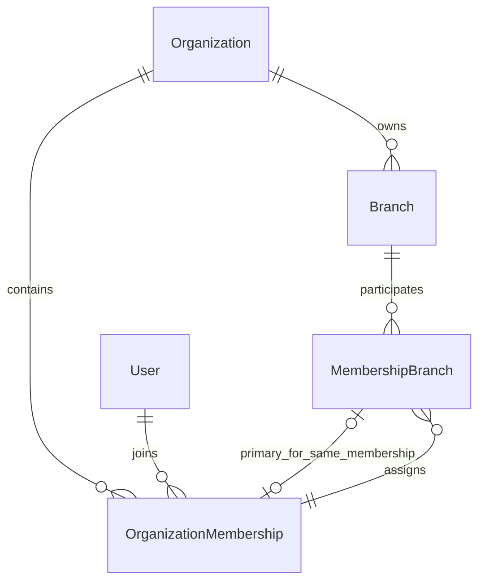
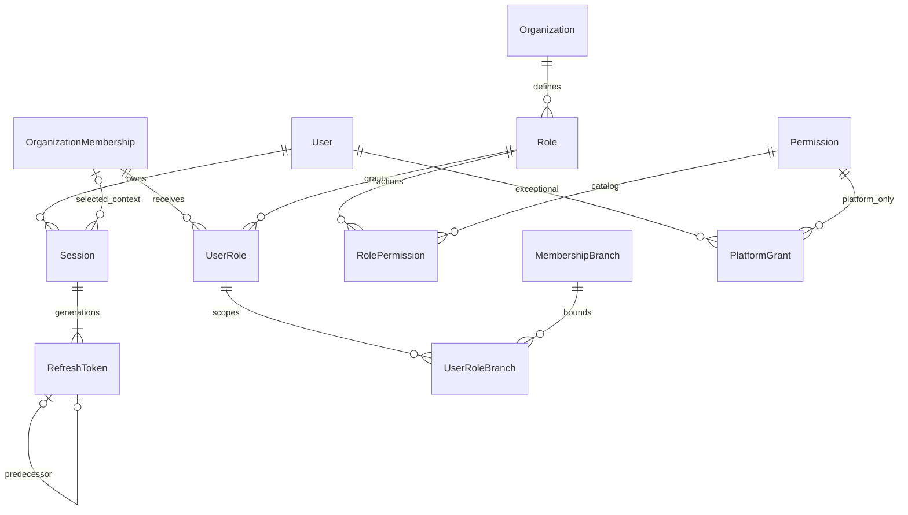

# Estratégia de banco de dados

## 1. Estado e decisões

O ERD abaixo é um modelo **conceitual futuro**, não uma ordem para gerar schema/migrations comerciais. A fase 1 criou InfrastructureMetadata. A fase 2 materializa exclusivamente Organization, Branch, User global, OrganizationMembership e MembershipBranch; consulte a seção de modelo físico atual, README e ADR-011. A fase 3 acrescenta credenciais, sessões e RBAC conforme a seção física ao final e ADR-012. O restante do ERD continua futuro. Campos e cardinalidades serão refinados por módulo; os limites de tenant e invariantes já são decisões obrigatórias. PostgreSQL com Prisma, schema compartilhado e `organization_id` em entidades tenant. Identidade `User` é global; empresa cliente `Company` é diferente de `Organization`.

UUID gerado pela aplicação/Prisma ou default PostgreSQL compatível com a versão escolhida. Começar com UUID v4; avaliar v7 apenas com suporte real e medição, sem substituir UUID por sequências públicas. Datas `timestamptz` em UTC; frontend converte para fuso da organização/usuário. Horários de automações/metas precisam armazenar também o fuso IANA usado na definição do período para lidar com mudanças de horário.

Prisma models PascalCase, campos camelCase, tabelas/colunas snake_case (`@@map`/`@map`). IDs relacionados usam `organizationId`, `branchId`, `ownerMembershipId`, etc. `createdAt`, `updatedAt` e `version` quando há concorrência relevante. `archivedAt` só em entidades com arquivamento; não aplicar soft delete universal.

## 2. Tenant, identidade e grants

- Organization: tenant contratante, configurações e estado.
- Branch: filial/loja, sempre em uma organização.
- Team: equipe de uma filial, sem concessão implícita de acesso.
- User: identidade global (e-mail e hash de senha), pode participar de várias organizações.
- OrganizationMembership: vínculo User/Organization, ativo/inativo, nome comercial opcional e metadados de vendedor. `unique(organization_id, user_id)`; reativação conserva identidade do vínculo para histórico.
- MembershipBranch: filiais permitidas para carteira/grants de filial de uma membership. Não substitui Role/Permission. Um grant ORGANIZATION autoriza suas ações no tenant inteiro sem enumerar todas as filiais; não expande grants OWN/BRANCH e sua revogação é independente da remoção de uma MembershipBranch.
- TeamMember: membership em equipe, no mesmo tenant; associação precisa de acesso à filial da equipe.
- Role/RolePermission: papéis tenant e permissões do catálogo global.
- UserRole: grant de papel para membership, com scope OWN/BRANCH/BRANCH_SET/ORGANIZATION. UserRoleBranch guarda as filiais do grant. BRANCH exige exatamente uma; BRANCH_SET exige pelo menos uma; ORGANIZATION/OWN não usam linhas de branch grant. Consistência multirow exige transação de application e teste; constraint trigger pode reforçá-la se necessário.

Usuário vendedor não precisa de entidade Seller paralela. OWN compara ownerMembershipId com membership, nunca `User.id` ignorando tenant. Grants de filial devem pertencer às filiais autorizadas da membership. Remover acesso a filial revoga/ajusta grants associados na mesma transação. Configuração de role não permite acesso além da autoridade do concedente.

## 3. Integridade e isolamento obrigatório

Cada tabela tenant inclui `organization_id NOT NULL`, salvo AuditLog global de autenticação explicitamente separado por política. Nas tabelas referenciadas, criar `unique(organization_id, id)` apesar de `id` já ser UUID global, para permitir FKs compostas. Child referencia parent por `(organization_id, parent_id) → (organization_id, id)`.

Exemplos de invariantes físicas:

- Opportunity: FK `(organization_id, contact_id)` para Contact, equivalente para Company, Lead, Branch e owner OrganizationMembership.
- PipelineStage: `(organization_id, pipeline_id)` para Pipeline; `unique(organization_id, pipeline_id, id)`.
- Opportunity: `(organization_id, pipeline_id, stage_id)` para PipelineStage. O mesmo tenant sozinho não impede estágio de outro pipeline.
- OpportunityStageHistory guarda fromPipelineId/toPipelineId e fromStageId/toStageId, com FKs triplas `(organization_id, from_pipeline_id, from_stage_id)` e `(organization_id, to_pipeline_id, to_stage_id)`, oportunidade e ator tenant. Origem pode ser nula na criação; destino é obrigatório. Pipeline de oportunidade não muda por PATCH comum; migração autorizada entre pipelines é caso de uso dedicado que preserva histórico do pipeline anterior.
- Team: branch do mesmo tenant. TeamMember inclui branchId como contexto e pode usar FKs compostas para Team e MembershipBranch, garantindo membership com acesso àquela filial.
- UserRole: membership e Role do mesmo tenant. UserRoleBranch referencia grant+membership e MembershipBranch, além de Branch, para não conceder filial fora do vínculo. Campos redundantes para FKs são controlados pela aplicação e uniques compostos.
- QuoteItem pertence a Quote; PriceListItem pertence a PriceList/Product da mesma organização. Referência de Opportunity/Quote a owner requer membership do tenant, mesmo que inativa posteriormente.
- Conversation é ligada a Channel; Message precisa ter canal e conversa compatíveis. Constraint composta `(organization_id, channel_id, conversation_id)` evita mensagem da conversa em outro canal. MessageAttachment herda tenant e Message.

`branch_id` opcional é uma escolha de compartilhamento, não bypass de acesso. Recursos comerciais atribuídos a filial devem apontar a membership autorizada no momento da atribuição. Em entidades nas quais owner precisa permanecer autorizado na filial, usar FK para MembershipBranch se lifecycle permitir; nos históricos/snapshots, preservar referência à membership e revogar poder, sem apagar autoria ao remover acesso. Regras temporais de carteira precisam de transação e teste, não apenas FK.

Repository sempre recebe contexto tenant e escopo explícitos; update/delete usa predicado tenant+ID+versão quando aplicável. Filtrar também contagens, joins, bulk, nested writes e SQL raw parametrizado. Nenhuma extensão automática Prisma substitui revisão dessas rotas. RLS poderá ser adotada como defesa adicional mediante ADR e testes de connection pooling/contexto/reset; não está implantada nem presumida.

FKs `RESTRICT` para entidades comerciais/históricas, arquivamento para não eliminar oportunidade/orçamento em cascata. Cascata permitida em filhos puramente estruturais descartáveis (por exemplo relação de papel) somente quando a política do caso permitir. Não fazer cascade de Organization para eliminar dados financeiros, mensagens e auditoria indiscriminadamente. Processo de eliminação de tenant é explícito, auditado e sujeito a retenção legal.

## 4. ERD inicial

Tipos são ilustrativos. O diagrama inclui entidades de suporte para memberships, RBAC, sessões, idempotência e execução; campos abreviados não retiram FKs/uniques descritas acima. `organizationId` é obrigatório em todas as entidades tenant, mesmo quando omitido de um bloco resumido. Relações opcionais/múltiplas refletem o modelo conceitual; detalhes físicos estão nos parágrafos seguintes.

```mermaid
erDiagram
    Organization {
        uuid id PK
        string name
        string status
    }
    Branch {
        uuid id PK
        uuid organizationId FK
        string name
    }
    Team {
        uuid id PK
        uuid organizationId FK
        uuid branchId FK
    }
    User {
        uuid id PK
        string normalizedEmail UK
        string passwordHash
    }
    OrganizationMembership {
        uuid id PK
        uuid organizationId FK
        uuid userId FK
        string status
    }
    MembershipBranch {
        uuid id PK
        uuid organizationId FK
        uuid membershipId FK
        uuid branchId FK
    }
    TeamMember {
        uuid id PK
        uuid organizationId FK
        uuid teamId FK
        uuid membershipId FK
        uuid branchId FK
    }
    Role {
        uuid id PK
        uuid organizationId FK
        string name
    }
    Permission {
        uuid id PK
        string code UK
    }
    RolePermission {
        uuid organizationId FK
        uuid roleId FK
        uuid permissionId FK
    }
    UserRole {
        uuid id PK
        uuid organizationId FK
        uuid membershipId FK
        uuid roleId FK
        string scope
    }
    UserRoleBranch {
        uuid organizationId FK
        uuid userRoleId FK
        uuid membershipId FK
        uuid branchId FK
    }
    Session {
        uuid id PK
        uuid userId FK
        datetime expiresAt
        datetime revokedAt
    }
    RefreshToken {
        uuid id PK
        uuid sessionId FK
        string tokenHash UK
        uuid predecessorId FK
        datetime usedAt
    }
    PasswordResetToken {
        uuid id PK
        uuid userId FK
        string tokenHash UK
        datetime expiresAt
        datetime usedAt
    }
    Contact {
        uuid id PK
        uuid organizationId FK
        uuid branchId FK
        uuid ownerMembershipId FK
        uuid companyId FK
    }
    Company {
        uuid id PK
        uuid organizationId FK
        uuid branchId FK
        uuid ownerMembershipId FK
    }
    Lead {
        uuid id PK
        uuid organizationId FK
        uuid branchId FK
        uuid ownerMembershipId FK
        uuid contactId FK
        uuid companyId FK
    }
    Pipeline {
        uuid id PK
        uuid organizationId FK
        uuid branchId FK
    }
    PipelineStage {
        uuid id PK
        uuid organizationId FK
        uuid pipelineId FK
        decimal position
    }
    Opportunity {
        uuid id PK
        uuid organizationId FK
        uuid branchId FK
        uuid ownerMembershipId FK
        uuid pipelineId FK
        uuid stageId FK
        uuid contactId FK
        uuid companyId FK
        uuid leadId FK
        int version
    }
    OpportunityStageHistory {
        uuid id PK
        uuid organizationId FK
        uuid opportunityId FK
        uuid fromPipelineId FK
        uuid toPipelineId FK
        uuid fromStageId FK
        uuid toStageId FK
        uuid actorMembershipId FK
        datetime occurredAt
    }
    Task {
        uuid id PK
        uuid organizationId FK
        uuid branchId FK
        uuid ownerMembershipId FK
        uuid contactId FK
        uuid leadId FK
        uuid opportunityId FK
        uuid conversationId FK
        datetime dueAt
    }
    Activity {
        uuid id PK
        uuid organizationId FK
        uuid actorMembershipId FK
        uuid opportunityId FK
        uuid contactId FK
        uuid leadId FK
        uuid conversationId FK
        uuid quoteId FK
        datetime occurredAt
    }
    Product {
        uuid id PK
        uuid organizationId FK
        string sku
        string status
    }
    PriceList {
        uuid id PK
        uuid organizationId FK
        uuid branchId FK
        string currency
    }
    PriceListItem {
        uuid id PK
        uuid organizationId FK
        uuid priceListId FK
        uuid productId FK
        decimal unitPrice
    }
    Quote {
        uuid id PK
        uuid organizationId FK
        uuid branchId FK
        uuid ownerMembershipId FK
        uuid opportunityId FK
        uuid contactId FK
        uuid companyId FK
        uuid priceListId FK
        string status
        int revision
        int version
        decimal total
    }
    QuoteItem {
        uuid id PK
        uuid organizationId FK
        uuid quoteId FK
        uuid productId FK
        string descriptionSnapshot
        decimal quantity
        decimal unitPriceSnapshot
        decimal total
    }
    Channel {
        uuid id PK
        uuid organizationId FK
        uuid branchId FK
        string medium
        string provider
    }
    WhatsAppInstance {
        uuid id PK
        uuid organizationId FK
        uuid channelId FK
        string providerConnectionNamespace
        string externalInstanceId
        string credentialReference
    }
    Conversation {
        uuid id PK
        uuid organizationId FK
        uuid channelId FK
        uuid branchId FK
        uuid ownerMembershipId FK
        uuid contactId FK
        string externalConversationId
    }
    Message {
        uuid id PK
        uuid organizationId FK
        uuid conversationId FK
        uuid channelId FK
        string externalMessageId
        string direction
        string status
        bigint sequence
    }
    MessageAttachment {
        uuid id PK
        uuid organizationId FK
        uuid messageId FK
        string storageKey
        string scanStatus
    }
    AutomationFlow {
        uuid id PK
        uuid organizationId FK
        uuid branchId FK
        int version
        json definition
    }
    AutomationExecution {
        uuid id PK
        uuid organizationId FK
        uuid flowId FK
        uuid triggeringEventId FK
        int flowVersion
        json definitionSnapshot
        string status
    }
    AutomationExecutionStep {
        uuid id PK
        uuid organizationId FK
        uuid executionId FK
        string stepKey
        string status
    }
    Goal {
        uuid id PK
        uuid organizationId FK
        uuid branchId FK
        uuid teamId FK
        uuid ownerMembershipId FK
        string scopeType
        datetime periodStart
        datetime periodEnd
    }
    Notification {
        uuid id PK
        uuid organizationId FK
        uuid recipientMembershipId FK
        uuid sourceEventId FK
        datetime readAt
    }
    AuditLog {
        uuid id PK
        uuid organizationId FK
        uuid actorUserId FK
        uuid actorMembershipId FK
        string action
        string entityType
        uuid entityId
        datetime occurredAt
    }
    WebhookEvent {
        uuid id PK
        uuid organizationId FK
        uuid channelId FK
        string dedupeKey
        string eventType
        json payload
        string status
        datetime receivedAt
    }
    OutboxEvent {
        uuid id PK
        uuid organizationId FK
        uuid parentEventId FK
        string eventType
        string destination
        string status
        datetime availableAt
        datetime leaseUntil
        string leaseToken
    }
    EventReceipt {
        uuid id PK
        uuid organizationId FK
        uuid outboxEventId FK
        string consumer
        datetime processedAt
    }
    IdempotencyRecord {
        uuid id PK
        uuid organizationId FK
        uuid actorMembershipId FK
        string operation
        string keyHash
        string requestHash
        string status
        datetime expiresAt
    }

    Organization ||--o{ Branch : owns
    Organization ||--o{ OrganizationMembership : includes
    User ||--o{ OrganizationMembership : joins
    Branch ||--o{ Team : groups
    OrganizationMembership ||--o{ MembershipBranch : accesses
    Branch ||--o{ MembershipBranch : permits
    OrganizationMembership ||--o{ TeamMember : participates
    Team ||--o{ TeamMember : includes
    Organization ||--o{ Role : defines
    Role ||--o{ RolePermission : grants
    Permission ||--o{ RolePermission : identifies
    OrganizationMembership ||--o{ UserRole : receives
    Role ||--o{ UserRole : assigned
    UserRole ||--o{ UserRoleBranch : restricts
    MembershipBranch ||--o{ UserRoleBranch : bounds
    User ||--o{ Session : opens
    Session ||--o{ RefreshToken : rotates
    RefreshToken o|--o| RefreshToken : succeeds
    User ||--o{ PasswordResetToken : requests

    Organization ||--o{ Contact : owns
    Organization ||--o{ Company : owns
    Company o|--o{ Contact : main_company
    Branch o|--o{ Contact : locates
    Branch o|--o{ Company : locates
    OrganizationMembership o|--o{ Contact : owns_portfolio
    OrganizationMembership o|--o{ Company : owns_portfolio
    Organization ||--o{ Lead : owns
    Branch ||--o{ Lead : receives
    OrganizationMembership o|--o{ Lead : assigned
    Contact o|--o{ Lead : identifies
    Company o|--o{ Lead : identifies
    Organization ||--o{ Pipeline : defines
    Branch o|--o{ Pipeline : specializes
    Pipeline ||--|{ PipelineStage : contains
    Organization ||--o{ Opportunity : owns
    Branch ||--o{ Opportunity : handles
    OrganizationMembership ||--o{ Opportunity : owns_portfolio
    Pipeline ||--o{ Opportunity : organizes
    PipelineStage ||--o{ Opportunity : current_stage
    Contact o|--o{ Opportunity : negotiates
    Company o|--o{ Opportunity : negotiates
    Lead o|--o| Opportunity : converts_to
    Opportunity ||--o{ OpportunityStageHistory : records
    Pipeline o|--o{ OpportunityStageHistory : from_pipeline
    Pipeline ||--o{ OpportunityStageHistory : to_pipeline
    PipelineStage o|--o{ OpportunityStageHistory : from_stage
    PipelineStage ||--o{ OpportunityStageHistory : to_stage
    OrganizationMembership o|--o{ OpportunityStageHistory : acts
    Organization ||--o{ Task : owns
    Branch ||--o{ Task : locates
    OrganizationMembership ||--o{ Task : assigned
    Opportunity o|--o{ Task : follows_up
    Contact o|--o{ Task : follows_up
    Lead o|--o{ Task : follows_up
    Conversation o|--o{ Task : follows_up
    Organization ||--o{ Activity : owns
    OrganizationMembership o|--o{ Activity : acts
    Opportunity o|--o{ Activity : timeline
    Contact o|--o{ Activity : timeline
    Lead o|--o{ Activity : timeline
    Conversation o|--o{ Activity : timeline
    Quote o|--o{ Activity : timeline

    Organization ||--o{ Product : owns
    Organization ||--o{ PriceList : defines
    Branch o|--o{ PriceList : specializes
    PriceList ||--o{ PriceListItem : contains
    Product ||--o{ PriceListItem : priced
    Organization ||--o{ Quote : owns
    Branch ||--o{ Quote : issues
    OrganizationMembership ||--o{ Quote : owns_portfolio
    Opportunity o|--o{ Quote : proposes
    Contact o|--o{ Quote : receives
    Company o|--o{ Quote : receives
    PriceList o|--o{ Quote : price_source
    Quote ||--|{ QuoteItem : contains
    Product o|--o{ QuoteItem : references

    Organization ||--o{ Channel : connects
    Branch o|--o{ Channel : locates
    Channel ||--o| WhatsAppInstance : provider_config
    Channel ||--o{ Conversation : hosts
    Branch o|--o{ Conversation : locates
    OrganizationMembership o|--o{ Conversation : assigned
    Contact o|--o{ Conversation : participates
    Conversation ||--o{ Message : contains
    Channel ||--o{ Message : transports
    Message ||--o{ MessageAttachment : attaches
    Channel ||--o{ WebhookEvent : receives
    Organization ||--o{ WebhookEvent : owns

    Organization ||--o{ AutomationFlow : defines
    Branch o|--o{ AutomationFlow : limits
    AutomationFlow ||--o{ AutomationExecution : executes
    OutboxEvent o|--o{ AutomationExecution : triggers
    AutomationExecution ||--o{ AutomationExecutionStep : checkpoints
    Organization ||--o{ Goal : defines
    Branch o|--o{ Goal : targets
    Team o|--o{ Goal : targets
    OrganizationMembership o|--o{ Goal : targets
    OrganizationMembership ||--o{ Notification : receives
    OutboxEvent o|--o{ Notification : sources
    Organization o|--o{ AuditLog : isolates
    User o|--o{ AuditLog : global_actor
    OrganizationMembership o|--o{ AuditLog : tenant_actor
    Organization ||--o{ OutboxEvent : emits
    OutboxEvent o|--o{ OutboxEvent : derives
    OutboxEvent ||--o{ EventReceipt : deduplicates
    OrganizationMembership ||--o{ IdempotencyRecord : requests
```

Pipeline e Quote precisam de pelo menos um estágio/item ao serem publicados/enviados; rascunhos podem estar vazios. A cardinalidade comercial não implica constraint SQL de mínimo de linhas automaticamente. Manter invariantes no caso de uso transacional. As linhas de ownership Organization no ERD são representativas; todas as demais entidades tenant também têm essa FK.

## 5. Regras por domínio

### Contatos, empresas, leads e oportunidades

Contact pode ter uma Company principal opcional; associação a múltiplas empresas com papéis ficará para requisito concreto. E-mail/telefone não são unique globalmente nem por padrão: contatos podem compartilhar dados. Telefone normalizado com país quando conhecido; preservar entrada e origem. Deduplicação/merge são casos autorizados que mantêm histórico, não deletion automática.

Company pode ter documento fiscal normalizado; unique parcial por tenant para documentos válidos presentes conforme país/política. Não forçar regras brasileiras sobre todas as organizações. Dados e endereço do comprador em quote são snapshots, independentes de futura alteração do contato.

Lead pode começar sem Contact/Company; conversão local opcional gera uma Opportunity e associa/cria Contact/Company. `Opportunity.leadId` é nullable e unique por tenant para impedir conversão duplicada; se o negócio futuramente exigir múltiplas oportunidades por lead, mudar constraint em decisão explícita. Conversão e criação compõem a mesma transação pelos contratos dos módulos.

Opportunity tem filial e proprietário obrigatórios, pipeline/stage coerentes, `version`, status e valores. Contact ou Company pode estar ausente durante negociação inicial; critérios de qualificação/fechamento serão definidos antes do caso de uso. Pipeline organizacional pode ser usado por filiais autorizadas; pipeline de filial não atende outra filial. Stage usa posição estável e desempate por ID, rebalanceamento transacional curto quando necessário. Não exigir posição fracionária única sem estratégia de corrida.

Mover Opportunity grava stage atual, versão, histórico e efeitos obrigatórios na mesma transação. History preserva pipeline/estágio anterior e novo, ator, instante e motivo; fromStage pode ser nulo na criação. Stages usados são arquivados, não excluídos. Mover para outro pipeline exige caso próprio e snapshots de origem/destino no histórico para não destruir a trajetória.

### Tarefas, atividades e metas

Task tem owner/filial, estado, vencimento e conclusão. Follow-up é tarefa com finalidade; não criar scheduler próprio. Task pode não ter alvo; quando tiver, exatamente um alvo primário entre Contact, Lead, Opportunity e Conversation. Activity exige exatamente um alvo primário entre esses e Quote, com ator opcional para sistema. FKs explícitas e CHECK de contagem de referências evitam `entityType/entityId` sem integridade; leituras de timeline podem agregar alvos relacionados através de política autorizada.

Goal tem período/fuso e tipo de escopo. CHECK distingue ORGANIZATION (sem alvo), BRANCH (branch), TEAM (team+branch coerentes) e USER (ownerMembership com branch opcional conforme meta). Métrica/unidade são explícitas; evitar misturar receita, contagem e moeda. Uniques do alvo+período+tipo previnem metas duplicadas quando a regra exigir.

### Produtos, preços e orçamentos

Product/SKU e tabelas de preço são tenant. Produtos podem ser arquivados; quote continua legível. PriceList pode ser organizacional ou da filial. PriceListItem inicialmente um preço vigente por produto/lista: `unique(organization_id, price_list_id, product_id)`. Histórico temporal de preço não é requisito inicial; snapshots garantem contratos anteriores.

Quote tem moeda, comprador/endereços e condições em snapshot, status, revisão, validade, aprovador e datas apropriadas. QuoteItem tem descrição/SKU, quantidade, unidade, preço, desconto, impostos aplicáveis e totais em snapshot. Alterar produto/lista não recalcula quote existente automaticamente. Produto opcional no item permite item avulso se autorizado. A versão aprovada/enviada é imutável; revisão cria nova identidade ligada ao original (`rootQuoteId`/`previousQuoteId`, refinados no módulo), com número/revisão unique por tenant. `revision` sozinho não guarda versões históricas.

Dinheiro/quantidade com `numeric`: proposta inicial amount `numeric(19,4)`, unit price e quantity `numeric(18,6)`. Moeda ISO 4217 explícita; cálculos com Decimal, API strings decimais. Definir moedas suportadas, escala e arredondamento por moeda antes do módulo de quotes; inicialmente apenas moedas de até quatro casas de liquidação. Somar itens arredondados conforme política única documentada e testada; não usar float IEEE-754, nem recalcular aprovação com preços atuais. CHECKs quantidade > 0, valores >= 0 e desconto dentro da política. Totais, limite de desconto e aprovação são regras backend em transação com version check.

### Messaging e integrações

Channel contém medium/provider e escopo comercial. WhatsAppInstance é configuração específica do adapter: namespace de instalação/provedor, externalInstanceId, estado e referência de credencial; nunca API key em texto. `unique(provider_connection_namespace, external_instance_id)` evita mapear uma mesma instância de uma instalação a tenants diferentes. Trocar instância preserva canal/histórico com procedimento explícito; IDs externos sempre incluem namespace/conexão, não apenas nome da instância.

Conversation pertence ao Channel e possui branch/owner conforme distribuição. `unique(organization_id, channel_id, external_conversation_id)` para identificador estável. Inicialmente conversa individual com Contact opcional; grupos/participantes múltiplos exigem modelo explícito futuro. Conversa sem owner não fica aberta a carteiras OWN: fila de atendimento precisa de permissão de triagem.

Message grava direção, estado, sequência, ID local/externo, tempos relevantes, versão e correlação. Unique parcial de mensagem externa por organização+canal+namespace+direção+externalMessageId presente. Outbound ainda sem external ID não colide. Message e Conversation têm canal coerente; múltiplos eventos de status atualizam a mesma Message. Estados/statusHistory quando necessários preservam eventos distintos sem regressão temporal. Sequência unique `(organization_id, conversation_id, sequence)`; allocation/lease de envio transacional e fora da chamada externa.

MessageAttachment guarda chave privada, MIME detectado, tamanho, checksum e estado de quarentena/scan, não blob no PostgreSQL. Autorização de download pelo tenant e conversa; URLs assinadas temporárias não são ACL permanente. Armazenar referência externa apenas para download controlado por adapter.

WebhookEvent de messaging vincula Channel e tenant resolvidos por credencial. Raw payload com limite, acesso restrito/criptografia e retenção curta definida na operação. Envelope indexável separado de JSON. Erro armazenado é sanitizado; sucesso HTTP significa aceitação durável, não processamento. Integrações não-messaging podem ganhar uma referência de conexão tipada em evolução do schema, sem reutilizar Channel para um ERP.

### Automações e notificações

AutomationFlow define steps permitidos e versão. Não suportar código arbitrário nem engine BPMN genérica. AutomationExecution captura versão e snapshot imutável da definição ao começar; alteração de flow não muda execução em andamento. `unique(organization_id, flow_id, triggering_event_id)` quando gatilho for evento; gatilhos agendados usam occurrence key equivalente. AutomationExecutionStep tem unique execução+stepKey e checkpoints de tentativas/resultado; efeitos externos seguem a mesma política de envio incerto.

Notification é persistida por destinatário membership e tem canal/status/leitura. Dedupe por evento+destinatário+tipo de entrega. Push Socket.IO apenas avisa sobre dados já persistidos. ImportJob/ReportJob serão registros de trabalho persistido quando essas features existirem, com status/checkpoint/artifact e autor/escopo; não se adicionam tabelas ou scaffolds vazios nesta fase.

## 6. Unicidade, idempotência e outbox

| Entidade                      | Chave/constraint planejada                                                                           |
| ----------------------------- | ---------------------------------------------------------------------------------------------------- |
| Role                          | tenant+nome normalizado                                                                              |
| RolePermission                | tenant+role+permission                                                                               |
| UserRole                      | tenant+membership+role+scope+identidade do grant; impedir duplicata exata no caso de uso             |
| MembershipBranch / TeamMember | tenant+membership+branch / tenant+team+membership                                                    |
| Product                       | tenant+SKU presente conforme política de arquivamento                                                |
| WebhookEvent                  | tenant+channel+tipo+dedupeKey, derivada da identidade estável do evento                              |
| Message                       | tenant+conexão namespace+canal+direção+externalMessageId presente                                    |
| OutboxEvent                   | tenant+evento de origem+destino quando for derivação, sem bloquear fatos distintos do mesmo agregado |
| EventReceipt                  | tenant+outboxEvent+consumer                                                                          |
| IdempotencyRecord             | tenant+actorMembership+operation+keyHash                                                             |
| Notification                  | tenant+sourceEvent+recipientMembership+deliveryType quando source presente                           |

PostgreSQL unique permite múltiplos NULL; partial uniques devem explicitar quando a identidade existe. Prisma pode não expressar todos os checks/índices parciais; migrations SQL revisadas são a autoridade. Não confiar em find-then-insert para dedupe: a constraint decide a corrida.

Outbox tem eventType/version, aggregateType/ID/versão, destino, payload mínimo, correlationId, availableAt, attemptCount, leaseToken/Until, dispatchedAt/completedAt e erro redigido. LeaseToken protege update de worker com posse antiga. Uma entrega lógica por linha; fanout usa linhas filhas identificadas por parentEventId+destino, criadas transacionalmente, quando necessário.

EventReceipt só é escrito com efeito local e conclusão na mesma transação. Envio externo necessita estado durável próprio; receipt não comprova entrega remota. IdempotencyRecord guarda request hash e resposta mínima/segura ou referência ao resultado, com status em andamento/concluído e retenção maior que a janela de retry documentada. Não incluir tokens ou secrets em respostas armazenadas. Recuperação de IN_PROGRESS usa estado comercial e transação, sem liberar execução só porque o tempo passou.

WebhookEvent + OutboxEvent e Opportunity + History + AuditLog + OutboxEvent relevante são transações locais atômicas. Não criar outbox para GET ou todo UPDATE. Dispatcher e reconciliador seguem `ARCHITECTURE.md`; retenção de receipts/eventos considera backups/replays para não ressuscitar efeitos após limpeza. Estado DISPATCHED não significa COMPLETED. Ao expirar payloads, conservar metadados mínimos de identidade/dedupe enquanto houver referências de AutomationExecution/Notification/receipts; não apagar em cascata o histórico comercial. Hard delete de outbox exige ausência de referências ou migração explícita para um registro de identidade arquivado, além de respeitar a janela de replay. Eventos derivados e receipts têm ordem de limpeza controlada.

## 7. Índices e consultas futuras

Começar pelos padrões de acesso reais; criar índices junto da feature, não todos especulativamente. Índices propostos:

| Consulta                      | Índice candidato                                                                                                         |
| ----------------------------- | ------------------------------------------------------------------------------------------------------------------------ |
| carteira de contatos          | `(organization_id, owner_membership_id, created_at DESC, id)` e variante filial se usada                                 |
| leads da filial por status    | `(organization_id, branch_id, status, created_at DESC, id)`                                                              |
| Kanban                        | `(organization_id, pipeline_id, stage_id, position, id)`; filtro filial/owner conforme plano medido                      |
| histórico de oportunidade     | `(organization_id, opportunity_id, occurred_at, id)`                                                                     |
| tarefas pendentes/vencidas    | `(organization_id, owner_membership_id, due_at, id)` parcial para status pendente                                        |
| mensagens paginadas           | `(organization_id, conversation_id, sequence DESC)`                                                                      |
| lista de conversas            | `(organization_id, branch_id, last_message_at DESC, id)`, variante owner se necessário                                   |
| quotes por status/filial      | `(organization_id, branch_id, status, created_at DESC, id)`                                                              |
| notificações não lidas        | `(organization_id, recipient_membership_id, created_at DESC, id)` parcial `read_at IS NULL`                              |
| webhook pendente/falho        | `(status, next_attempt_at, received_at, id)` técnico; consultas tenant também filtradas                                  |
| despacho/reconciliação outbox | parcial `(available_at, id)` para pendentes; `(lease_until, id)` para leases e `(dispatched_at, id)` para não concluídos |
| auditoria                     | `(organization_id, occurred_at DESC, id)` e `(organization_id, entity_type, entity_id, occurred_at)`                     |

Índices técnicos globais de outbox/webhook são acessados apenas por workers operacionais autorizados; não seguem tenant-first porque buscam trabalho de todos os tenants, mas cada item processa em contexto restrito. PostgreSQL não cria automaticamente índice em toda FK; analisar caminhos e adicionar índices úteis.

Evitar N+1, incluir apenas campos necessários, keyset pagination estável e limites de joins/in-lists. Busca textual começa por normalização e índices suportados; `pg_trgm`/full-text só mediante volume e idioma reais. JSONB não substitui colunas/FKs de campos de filtro; GIN apenas para queries medidas. Validar com EXPLAIN (ANALYZE, BUFFERS) em dados sintéticos representativos, nunca rodar consultas de teste pesadas sem autorização em produção. Relatórios pesados saem da request e usam projeções revisadas; não há warehouse ou particionamento automático inicial.

## 8. Migrations, geração e deploy

1. Atualizar schema junto à feature; gerar migration nomeada em snake_case, revisar SQL e drift num banco local descartável.
2. Incluir SQL manual para composite FKs/checks/partial indexes exigidos e testar compatibilidade com introspecção/client da versão Prisma adotada.
3. Gerar Prisma Client; testar banco vazio e migração a partir da release anterior, constraints negativas e consultas importantes.
4. Deploy aplica migrations via job único com credencial DDL separada da aplicação, `migrate deploy`; aplicação não executa migrations em cada bootstrap.
5. Mudança incompatível usa expand (coluna nova nullable/contratos compatíveis) → backfill em batches com checkpoint → validação → contract em release posterior. API e worker antigos continuam funcionando durante a expansão.
6. DDL de grande tabela requer avaliação de locks. `CREATE INDEX CONCURRENTLY` precisa execução compatível fora de transação que o impeça; registrar procedimento e verificação do estado da migration/índice. Não fingir que uma migration transacional serve para todo índice.
7. Backup/restore testado antes de mudança destrutiva. Rollback de app preferido quando schema compatível; forward fix para migrations aplicadas. Reversão de dados só com plano específico/backup. Não editar histórico aplicado, usar `db push` em produção ou resetar dados para contornar drift.

Seeds sintéticos locais determinísticos e repetíveis, sem credenciais padrão de produção. Separar bootstrap necessário do tenant de dados de demonstração. URL de banco validada por ambiente e operação; testes não apontam para banco de desenvolvimento persistente/produção inadvertidamente. Manifests/comandos técnicos foram criados na fase 1. A migration técnica `20261006130000_infrastructure_metadata` permanece imutável. A fase 2 adiciona `20261006144000_create_organization_branch_user_foundation`. Seed transacional/idempotente preserva o marcador foundation/versão 1 e cria somente os dados organizacionais demo descritos no README; recusava NODE_ENV=production e não criava credenciais/permissões na fase 2; a fase 3 usa o bootstrap seguro descrito ao final. Os procedimentos de evolução comercial desta seção continuam planejados.

## 9. Retenção, privacidade e recuperação

Dados comerciais, payloads webhook, outbox/receipts, mídia, audit e logs têm retenções distintas e aprovadas. Definir janela do provedor, dedupe/replay, recuperação de backup e exigência legal antes de jobs de limpeza; não adotar TTL curto arbitrário em evento que pode ser reenviado.

Arquivo/soft delete é lifecycle comercial, não eliminação LGPD. Planejar anonimização/exclusão das referências pessoais, mídia e fornecedores com ledger de exclusões e reaplicação após restore. Audit entityType/entityId é referência forense intencional, sem FK ao objeto que pode ser eliminado; gravação exige validação tenant no caso de uso e payload redigido. Audit ator membership/user pode ser pseudonimizado conforme política, mantendo trilha mínima legalmente justificada.

Backups criptografados, acesso mínimo, PITR quando requerido e exercícios de restore medindo RPO/RTO. Após restore, reconciliar outbox, mensagens e checkpoints externos antes de ativar workers; um backup antigo pode conter estado pendente de um efeito externo já realizado. Suspender reenvio incerto até reconciliação para não duplicar mensagens/ERP. PostgreSQL é ponto único de falha inicial; backup não é alta disponibilidade.

## Modelo físico da fase 2 — histórico

O ERD conceitual acima inclui hash de senha e outros campos futuros; o schema ao término da fase 2 **não possuía passwordHash, roles, sessões, Team ou entidades comerciais**. UUID v4 é gerado pelo Prisma, timestamps timestamptz(6)/UTC, active usa default true e updatedAt é mantido pelo Prisma. Não existe soft delete indiscriminado. Nenhum endpoint de transferência/desativação está implementado.

| Modelo                 | Campos e invariantes atuais                                                                                |
| ---------------------- | ---------------------------------------------------------------------------------------------------------- |
| Organization           | id, name, legalName opcional, document opcional, active, createdAt, updatedAt                              |
| Branch                 | id, organizationId obrigatório, name, code configurável, active, timestamps; unique(organizationId,code)   |
| User                   | identidade global: id, name, email globalmente único, active, timestamps; sem organizationId/branchId/hash |
| OrganizationMembership | id, organizationId, userId, primaryBranchId opcional, active, timestamps; unique(organizationId,userId)    |
| MembershipBranch       | id, organizationId, membershipId, branchId, timestamps; unique(organizationId,membershipId,branchId)       |

MembershipBranch possui FKs `(organizationId,membershipId) → OrganizationMembership(organizationId,id)` e `(organizationId,branchId) → Branch(organizationId,id)`. As duas tabelas parent têm uniques compostas tenant+id para sustentar essas relações. A principal usa FK `(organizationId,id,primaryBranchId) → MembershipBranch(organizationId,membershipId,branchId)`: não pode apontar a outro tenant, outra membership ou filial não atribuída. Todas as FKs usam RESTRICT em delete/update. A principal nullable permite criar membership, vínculos e definir principal na mesma transação; remover sua associação requer limpar/trocar a principal antes. Não há branch órfã nem membership sem organização/identidade. User global legítimo pode possuir memberships em vários tenants, cada um com sua própria principal.

Unicidade de e-mail é no valor canônico trim/lowercase; CHECK users_email_canonical rejeita writes diretos não normalizados. Branch.code usa `[A-Z0-9][A-Z0-9_-]{0,63}` e CHECK correspondente, e nunca enum de lojas. Documento opcional é normalizado para `[A-Z0-9]{1,64}` em maiúsculas, removendo espaços/ponto/barra/hífen; CHECK aceita NULL. Não há unicidade de documento sem definição de país/emissor, validação fiscal ou índice não utilizado. Names são trim/não vazios pela validação do servidor. Esses três CHECKs foram adicionados na migration gerada porque não podem ser expressos no schema Prisma; preservar em migrations futuras e revisar SQL.

Índices implementados são somente PKs, uniques descritas e OrganizationMembership(userId)/MembershipBranch(organizationId,branchId) para lookup/referências reversas. Uniques tenant+id já cobrem as listagens por tenant e cursor UUID crescente; tenant+code cobre código de filial; tenant+membership+branch cobre vínculos. Não criar um índice redundante só em organizationId. Cursor não significa ordem cronológica.

Criações de User e membership/branches/principal são uma única transação. Unique constraints decidem criações concorrentes, sem confiar em find-then-insert; API retorna 409 e não vaza erro Prisma/SQL. Consultas organizacionais têm filtro explícito tenant e limites. Esses controles protegem integridade/seleção de dados, não autorização HTTP: auth/RLS não estão implementados; não expor a API local antes da fase 3. Vínculos vazios não concedem ORGANIZATION.

Seed usa organização demo UUID fixo, usuário por e-mail único, filiais por tenant+code, membership por tenant+user e vínculos por chave composta. Repetir conserva IDs/timestamps e edições existentes. O nome Administrador demo não é uma concessão de poder. A integração aplica ambas as migrations em PostgreSQL/volume novo, repete deploy e seed, verifica constraints e relações cruzadas diretamente no banco e exercita concorrência pela API; o banco de desenvolvimento anterior também recebe a nova migration sem reset.

## Modelo físico incremental — fase 3

Migration `20261006180000_create_auth_sessions_rbac` sucede as duas migrations imutáveis anteriores, gerada por Prisma e complementada somente com checks e constraint triggers PostgreSQL que Prisma não expressa. Nenhuma tabela comercial ou outbox.

User adiciona passwordHash nullable (identidades estruturais sem credencial não autenticam) e securityVersion >=0. Session global inclui userId, membershipId opcional, contextVersion/securityVersion, prazo absoluto, revogação e timestamps. FK (userId,membershipId) → OrganizationMembership(userId,id) impede contexto de outra identidade. Índice (userId,revokedAt) atende revogação por usuário. RefreshToken contém somente tokenHash SHA-256 unique, sessão, predecessor e usedAt. FK (sessionId,predecessorId) → RefreshToken(sessionId,id) impede encadear famílias; predecessor unique impede dois sucessores. Histórico é mantido para detectar reuso, sem delete de gerações durante validade da sessão.

Role: tenant/code unique; Permission: code global unique/domain; RolePermission: PK organizationId/roleId/permissionId, FK tenant/role e permission/domain, CHECK domínio ORGANIZATION. UserRole liga membership/role por FKs tenant compostas, scopeKey canônico (none para OWN/ORGANIZATION, SHA-256 de branchIds ordenados para BRANCH/BRANCH_SET), unique tenant/member/role/scope/scopeKey contra duplicação concorrente. ALL é proibido por CHECK em UserRole. UserRoleBranch referencia (tenant,grant,membership) e (tenant,membership,branch), impedindo concessão fora do vínculo. Constraint triggers deferred verificam BRANCH=1 filial, BRANCH_SET>=1, OWN/ORGANIZATION=0 ao commit; operação inteira é transacional. Grant children descartáveis usam cascade; definição/pessoas/tenant permanecem RESTRICT.

PlatformGrant é exceção separada com userId/permissionId unique, domínio PLATFORM, scope ALL, motivo obrigatório e expiresAt. FKs permission/domain e CHECKs impedem misturar permissões tenant/plataforma. Somente organizations.create existe nesse domínio; não dá acesso irrestrito a dados. Seed opt-in limita a 24h. Não há plataforma grant endpoint nem SUPER_ADMIN automático.

Sessão por login/dispositivo, refresh consume e successor sob lock de Session, sem transação externa/HTTP. Reuso retorna resultado da transação e só então 401, preservando revogação. Mudança de senha usa compare-and-set credencial/securityVersion e revoga sessões na mesma transação; logout-all incrementa versão. Login concorrente com snapshot antigo não concede acesso após mudança. Grants administrativos bloqueiam memberships em ordem antes de reler autorização; todas as queries/grants levam organizationId.

Seed movido para bootstrap da API, pois hash/roles são responsabilidade dos módulos backend. Prisma config invoca esse bootstrap; packages/database não ganhou domínio. Seed pede SEED_ADMIN_PASSWORD, recusa produção e não redefine hash já existente. Upserts preservam IDs, timestamps e desativações; templates/grants não duplicam. Rotação da senha demo existente utiliza change-password, não a repetição do seed. Retenção/limpeza periódica de sessões expiradas será definida por operação/LGPD quando houver uso real; não remover histórico de refresh de sessões ainda válidas.

A migration incremental `20261006190000_enforce_grant_branch_reparenting` reforça o constraint trigger para verificar tanto o grant antigo quanto o novo em UPDATE de UserRoleBranch. A primeira migration de auth já havia sido testada; permaneceu imutável. O teste de realocação direta confirma rollback se o grant antigo perder sua filial obrigatória.
