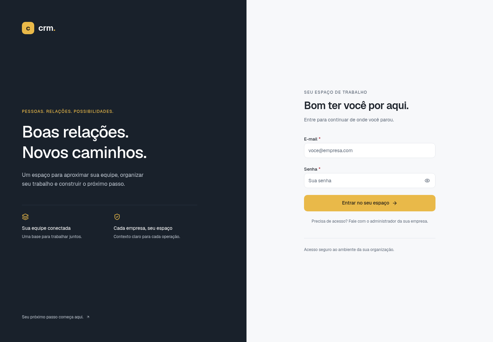
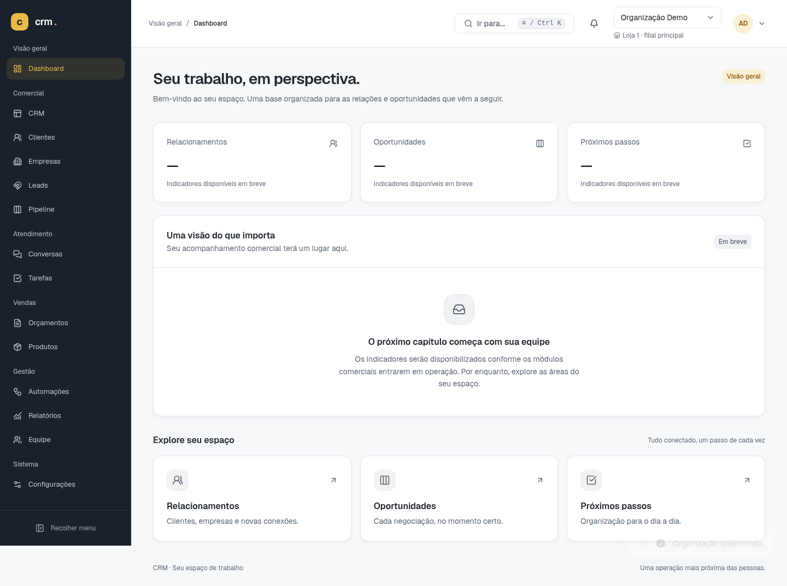
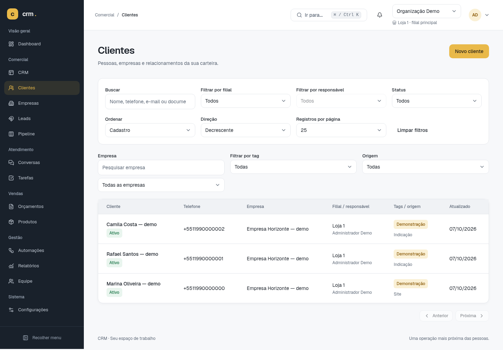
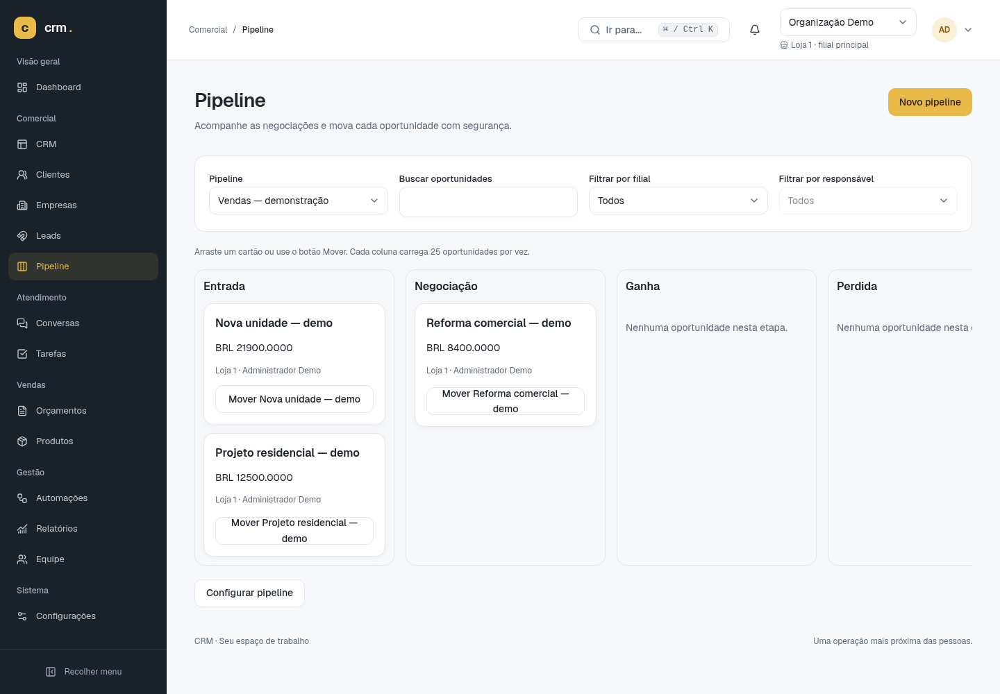
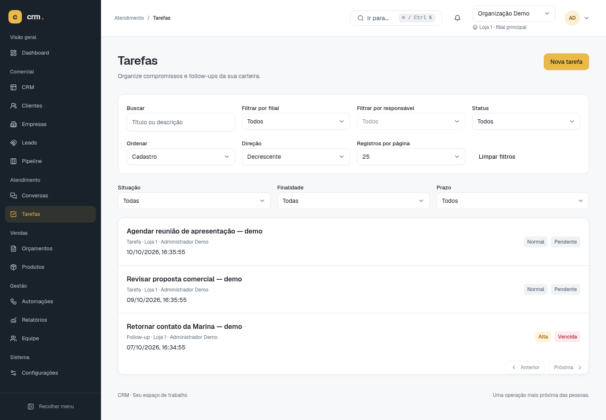
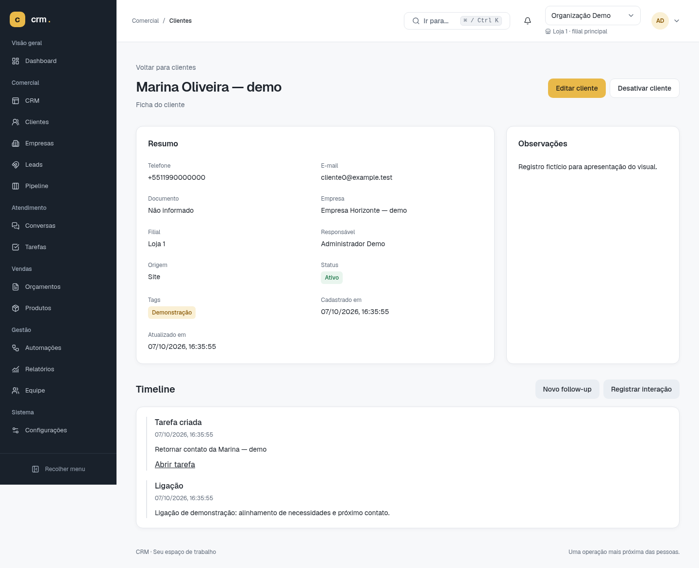
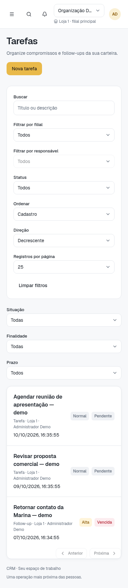
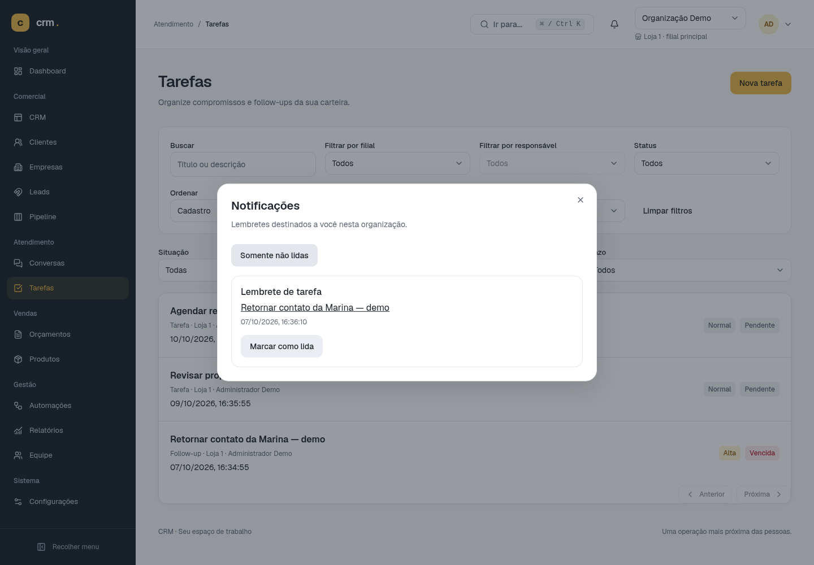

# Visual do CRM — Fase 7

Capturas reais da aplicação em 7 de outubro de 2026, publicadas com autorização explícita do responsável pelo projeto. Os registros exibidos são fictícios e foram criados em um ambiente descartável, separado do banco de desenvolvimento.

A visão geral apresenta a tela-base atual; os indicadores comerciais ainda não foram implementados. Itens de módulos futuros no menu não significam que essas funcionalidades estão disponíveis.

Abra uma imagem para ampliar. Na página do arquivo no GitHub, use **Download raw file** para baixar o PNG original.

## Login

[Abrir imagem original](01-login.png)

## Visão geral

[Abrir imagem original](02-visao-geral.png)

## Clientes

[Abrir imagem original](03-clientes.png)

## Pipeline / Kanban

[Abrir imagem original](04-pipeline-kanban.png)

## Tarefas

[Abrir imagem original](05-tarefas.png)

## Ficha do cliente e timeline

[Abrir imagem original](06-cliente-timeline.png)

## Tarefas no celular

[Abrir imagem original](07-tarefas-celular.png)

## Notificações

[Abrir imagem original](08-notificacoes.png)

